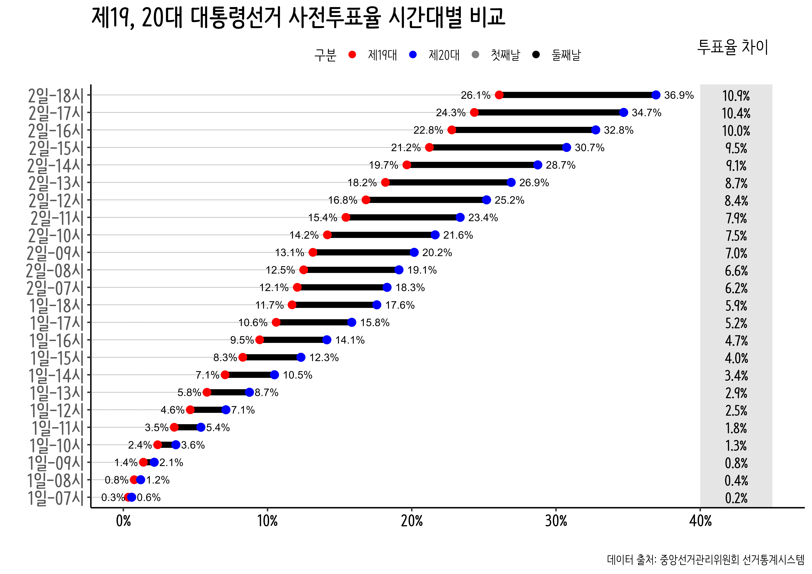

---
output: html_document
editor_options: 
  chunk_output_type: console
---

```{r setup, echo = FALSE, message = FALSE}
source("_common.R")
library(tidyverse)
library(patchwork)
library(lubridate)

```


# 데이터 저널리즘 {#case-journalism}

오마이뉴스 [제20대 대통령 선거, 사전투표 역사를 새로 쓰다 - 마의 30%대 넘긴 사전투표율](http://omn.kr/1xnps) 데이터 저널리즘 기사에 포함된 시각화 객체를 작성해보자. 제20대 대통령선거에서 사전투표율이 30%를 넘긴 사실과 이를 한눈에 사전투표율 변화를 제19대 대통령선거와 비교하여 2일에 걸쳐 실시된 사전투표를 그래프 우측에 사전투표율 차이를 꼼꼼히 작성한 것이 이채로운 기사다.

이 기사를 작성하기 위해 공공데이터를 크롤링하여 정제하는 과정을 거치고 이를 다양한 시각화 방법론 중에서 독자에게 객관적인 사실을 읽기 편하고 정보를 제대로 제공할 수 있는 형태로 전달하도록 `ggplot`을 사용해서 제작했다.

## 크롤링 {#case-study-crawling}

먼저 [중앙선거관리위원회 선거통계시스템](http://info.nec.go.kr/) 웹사이트에서 제19대
대통령선거 사전투표율 데이터를 시도별로 크롤링한다. 오마이뉴스 기자가 제19대와 제20대를 비교하여 5년간의 사전투표율 변화를 통해 유권자의 표심과 사회적 변화를 담아내고자 두 시점 2017년과 2022년을 각각 가져온다.

### 제19대 대통령 선거 {#case-study-19th}

중앙선관위 선거통계시스템에서 시도별로 사전투표율 데이터를 조회하도록 했기 때문에 각 시도별로 반복이 필요하기 때문에 함수로 작성해서 특정 시도를 기준으로 테스트 작업을 수행한다.

```{r data-19th, eval = FALSE, echo=TRUE}
# 0. 패키지 ----------------
library(tidyverse)
library(rvest)
library(httr)
library(lubridate)

## 크롤링 함수 

get_early_voting_data <- function(sido_code = "1100", date_code = "1") {
  
  cat("\n------------------------------\n", sido_code, ":", date_code, "\n")
  
  nec_url <- glue::glue("http://info.nec.go.kr/electioninfo/electionInfo_report.xhtml?",
                      "electionId=0000000000",
                      "&requestURI=%2FWEB-INF%2Fjsp%2Felectioninfo%2F0000000000%2Fvc%2Fvcap01.jsp",
                      "&topMenuId=VC",
                      "&secondMenuId=VCAP01",
                      "&menuId=VCAP01",
                      "&statementId=VCAP01_%234",
                      "&oldElectionType=1",
                      "&electionType=1",
                      "&electionName=20170509",
                      "&cityCode={sido_code}",
                      "&dateCode={date_code}")

  Sys.setlocale("LC_ALL", "C")
  
  nec_html <- read_html(nec_url)
  
  nec_raw <- nec_html %>% 
    html_element(css = '#table01') %>% 
    html_table(fill = TRUE)
  
  Sys.setlocale("LC_ALL", "Korean")
  
  nec_colnames <- nec_raw %>% 
    janitor::clean_names(ascii = FALSE) %>% 
    slice(1) %>% 
    unlist() %>% 
    as.character() %>% 
    dput()
  
  nec_tbl <- nec_raw %>% 
    janitor::clean_names(ascii = FALSE) %>% 
    slice(2:n()) %>% 
    set_names(nec_colnames) %>% 
    pivot_longer(`7시`:`18시`, names_to = "시간", values_to = "값") %>% 
    mutate(구분 = ifelse(str_detect(값, "%"), "투표율", "투표자수")) %>% 
    pivot_wider(names_from = 구분, values_from = 값)
  
  nec_tbl

}

# get_early_voting_data("4900", "2") # 함수테스트
```

### 데이터 긁어오기 {#case-19th-crawling}

앞서 작성한 함수를 시도 및 구시군별 크롤링하여 데이터프레임으로 저장한다.
특이한 점은 `map2` 함수형 프로그래밍 기법을 적용하여 코드를 `for`문 없이
간결하게 작성했다.

```{r case-19th-data, eval = FALSE, echo=TRUE}
presid_sigungu_code_2017 <- read_csv("data/presid_sigungu_code_2017.csv")

early_voting_code <- presid_sigungu_code_2017 %>% 
  group_by(시도코드, 시도명) %>% 
  summarise(n = n()) %>% 
  ungroup() %>% 
  select(-n)

early_voting_2017_raw <- early_voting_code %>% 
  mutate(사전투표일 = rep(list(c(1, 2)), n())) %>% 
  unnest(사전투표일) %>% 
  mutate(data = map2(시도코드, 사전투표일, get_early_voting_data))
```

### 데이터 정제 {#case-19th-cleaning}

제19대 대통령 선거 구시구별 사전투표일 누적투표수를 시각화 가능한 형태로 저장시킨다.

```{r case-19th-data-cleansing, eval = FALSE, echo=TRUE}
early_voting_2017_tbl <- early_voting_2017_raw %>% 
  unnest(data, names_repair = "unique")  %>% 
  janitor::clean_names(ascii = FALSE) %>% 
  set_names(c("시도코드", "시도명_2", "사전투표일", "구시군명", "선거인수", 
              "시간", "투표자수", "투표율", "시도명_9")) %>% ## 변수명 R4.2 버그 
  rename(시도명 = 시도명_2) %>% 
  mutate(구시군명 = ifelse(is.na(시도명_9), 구시군명, 시도명_9)) %>% 
  select(-시도코드, -시도명_9) 

early_voting_2017_order <- early_voting_2017_tbl %>% 
  select(시도명, 구시군명, 사전투표일, 시간, 선거인수, 투표자수) %>% 
  filter(구시군명 != "합계") %>% 
  pivot_wider(names_from = 사전투표일, values_from = 투표자수) %>% 
  mutate(across(선거인수:`2`, parse_number )) %>% 
  group_by(시도명, 구시군명) %>% 
  mutate(누적투표수 = max(`1`) + `2`)  %>% 
  ungroup() %>% 
  select(-`2`) %>% 
  pivot_longer(`1`:누적투표수, names_to = "사전투표일", values_to = "누적투표수") %>% 
  mutate(사전투표일 = ifelse(사전투표일 == "누적투표수", "2일", "1일")) %>% 
  mutate(시간순서 = glue::glue("{사전투표일}-{시간}")) %>% 
  arrange(시도명, 구시군명, 시간순서) 

early_voting_2017 <- early_voting_2017_order %>% 
  mutate(사전투표율 = 누적투표수 / 선거인수) %>% 
  mutate(선거구분 = "제19대") %>% 
  relocate(선거구분, .before = 시도명)

early_voting_2017 %>% 
  write_rds("data/early_voting_2017.rds")

```

## 제20대 대통령 선거 {#case-20th}  

제20대 대통령선거 사전투표율 데이터도 제19대 대통령선거와 동일한 방식으로 
크롤링한다.

### 크롤링 함수 {#case-20th-crawling-function}  

제19대와 달리 제20대는 데이터 제공방식에 차이가 있어 크롤링함수를 이에 맞춰 
작성하여 시도별로 크롤링할 수 있는 함수를 제작한다.

```{r case-crawling-20th, eval=FALSE, echo = TRUE}

get_early_voting_data_latest <- function(sido_code = "1100", date_code = "1", time_code = "07") {
  
  cat("\n------------------------------\n", sido_code, ":", date_code, ":", time_code, "\n")
  
  nec_url <- glue::glue("http://info.nec.go.kr/electioninfo/electionInfo_report.xhtml?",
                      "electionId=0020220309",
                      "&requestURI=%2FWEB-INF%2Fjsp%2Felectioninfo%2F0020220309%2Fvc%2Fvcap01.jsp",
                      "&topMenuId=VC",
                      "&secondMenuId=VCAP01",
                      "&menuId=VCAP01",
                      "&statementId=VCAP01_%232",
                      "&cityCode={sido_code}",
                      "&dateCode={date_code}",
                      "&timeCode={time_code}")
  
  Sys.setlocale("LC_ALL", "C")
  
  nec_html <- read_html(nec_url)
  
  nec_raw <- nec_html %>% 
    html_element(css = '#table01') %>% 
    html_table(fill = TRUE)
  
  Sys.setlocale("LC_ALL", "Korean")
  
  nec_tbl <- nec_raw %>% 
    set_names(c("구시군명", "선거인수", "사전투표자수", "사전투표율"))
  
  nec_tbl

}

# get_early_voting_data_latest("4900", "2", "17")
```

### 데이터 긁어오기 {#case-20th-crawling}

크로링함수가 완성되었다면 시도코드와 사전투표일, 사전투표시간을 달리하여 
함수형프로그래밍 기법을 적용하여 간결한 크롤링함수를 작성한다.

```{r case-20th-data, eval = FALSE, echo=TRUE}

early_voting_2022_raw <- early_voting_code %>% 
  mutate(사전투표일 = rep(list(c(1, 2)), n())) %>% 
  unnest(사전투표일) %>% 
  mutate(사전투표시간 = rep(list( c(7:18)), 34 )) %>% 
  unnest(사전투표시간) %>% 
  mutate(사전투표시간 = as.character(사전투표시간) %>% str_pad(., 2, "left", pad = "0")) %>% 
  mutate(data = pmap(list(시도코드, 사전투표일, 사전투표시간), get_early_voting_data_latest))

# early_voting_2022_raw
```

### 데이터 정제 {#case-20th-cleaning}

제20대 대통령 선거 구시구별 사전투표일 누적투표수를 시각화 가능한 형태로 저장시킨다.

```{r case-20th-data-cleansing, eval = FALSE, echo=TRUE}

early_voting_2022_tbl <- early_voting_2022_raw %>% 
  mutate(data = map(data, ~.x %>% mutate_all(., as.character ) )) %>%
  unnest(data, names_repair = "unique") %>% 
  mutate(across(선거인수:사전투표율, parse_number))

early_voting_2022_order <- early_voting_2022_tbl %>% 
  filter(구시군명 != "합계") %>% 
  select(시도명, 구시군명, 사전투표일, 시간=사전투표시간, 선거인수, 투표자수=사전투표자수) %>% 
  pivot_wider(names_from=사전투표일, values_from = 투표자수) %>% 
  group_by(시도명, 구시군명) %>% 
  mutate(누적투표수 = max(`1`) + `2`)  %>% 
  ungroup() %>% 
  select(-`2`) %>% 
  pivot_longer(`1`:누적투표수, names_to = "사전투표일", values_to = "누적투표수") %>% 
  mutate(사전투표일 = ifelse(사전투표일 == "누적투표수", "2일", "1일")) %>% 
  mutate(시간순서 = glue::glue("{사전투표일}-{시간}")) %>% 
  arrange(시도명, 구시군명, 시간순서) 

early_voting_2022 <- early_voting_2022_order %>% 
  mutate(사전투표율 = 누적투표수 / 선거인수) %>% 
  mutate(선거구분 = "제20대") %>% 
  relocate(선거구분, .before = 시도명) %>% 
  filter(구시군명 != "합계") %>% 
  mutate(시간 = as.numeric(시간)) %>% 
  mutate(시간 = glue::glue('{str_pad(시간, 2, "left", "0")}시'))

early_voting_2022 %>% 
  write_rds("data/early_voting_2022.rds")

```


## 결합 : 19대 + 20대 {#case-19th-20th}

앞서 크로링한 19대와 20대 대통령선거 사전투표 구시군별 시간대별 데이터를 
데이터프레임으로 결합하여 시각화를 준비한다.

```{r nineteen-twenty, eval = FALSE, echo = TRUE}
early_voting_2022 <-  
  read_rds("data/early_voting_2022.rds")

early_voting_2017 <-  
  read_rds("data/early_voting_2017.rds")

early_voting <- bind_rows(early_voting_2017, early_voting_2022)

# early_voting
```

## 데이터프레임 {#early-voting-dataframe}

시간대별로 제19대와 제20대 대통령선거를 비교하여 시각화하기 위해 `ggplot`에 입력값인
데이터프레임에 필요한 변수작업을 사전 준비하여 시각화에 집중할 수 있도록 작업내용을 
구분해둔다.

```{r dataframe-for-early-voting, echo = TRUE, eval=FALSE}
early_voting_timeline <- early_voting %>% 
  group_by(선거구분, 시간순서) %>% 
  summarise(선거인수 = sum(선거인수),
            사전투표수 = sum(누적투표수)) %>% 
  ungroup() %>% 
  mutate(사전투표율 = 사전투표수 / 선거인수) %>% 
  ## 시간순서 맞춤 
  separate(시간순서, into = c("일", "시간"), sep = "-") %>% 
  mutate(across(일:시간, parse_number)) %>% 
  mutate(시간 = str_pad(시간, 2, "left", "0")) %>% 
  mutate(시간순서 = glue::glue("{일}일-{시간}시")) %>% 
  select(선거구분, 시간순서, 사전투표율) %>% 
  ## ggalt::geom_dumbbell
  pivot_wider(names_from = 선거구분, values_from = 사전투표율) %>% 
  mutate(구분 = ifelse(str_detect(시간순서, "1일"), "첫째날", "둘째날")) 

```


## 시각화 {#timeline-viz-diff}

뉴스기사에 바로 사용할 수 있는 고품질 `ggplot` 객체를 작성하여 `png` 파일로 
작성하여 로컬 파일로 내보낸다. 기본 개념은 시간에 대한 순서를 정렬하여 맞추고
두선거를 아령그래프를 주된 시각화기법을 두고 작성한 후 독자가 큰 흐름을 읽을 수 
있게 만들고 마지막으로 우측에 20대 대선과 19대 대선 시간대별 투표율 차이를 
계산하여 한번에 필요한 모든 정보를 독자가 얻을 수 있도록 제작한다.

```{r viz-timeline-diff, eval = FALSE, echo = TRUE}
library(ggalt)

early_voting_timeline_diff_g <- early_voting_timeline %>% 
  mutate(차이 = 제20대 - 제19대) %>% 
  ggplot(aes(y = 시간순서, x = 제19대, xend = 제20대)) +
     geom_dumbbell(aes(color = 구분), size=3, colour_x = "red", colour_xend = "blue",
                dot_guide=TRUE, dot_guide_size=0.25) +
    theme_classic(15, base_family = "NanumBarunPen") +
    theme(legend.position = "top",
          legend.title=element_text(size=15), 
          legend.text=element_text(size=13),
          strip.text.x = element_text(size = rel(1.3), colour = "black", family = "NanumMyeongjo", face="bold"),
          axis.text.y = element_text(size = rel(1.5), colour = "gray35", family = "NanumBarunpen", face="bold"),
          axis.text.x = element_text(size = rel(1.3), colour = "black", family = "NanumBarunpen", face="bold"),
          strip.background=element_rect(fill="gray95"),
          plot.title=element_text(size=25, face="bold", family = "NanumBarunpen"),
          plot.subtitle=element_text(face="bold", size=13, colour="grey10", family = "NanumBarunpen"),
          plot.tag.position = c(0.91, 0.93))  +
    labs(x="",
         y="",
         title = "제19, 20대 대통령선거 사전투표율 시간대별 비교",
         caption = "데이터 출처: 중앙선거관리위원회 선거통계시스템",
         tag = "투표율 차이") +
    scale_x_continuous(labels = scales::percent, limits = c(0, 0.45)) +
    scale_color_manual(values = c(
      "제19대" = "red",
      "제20대" = "blue",
      "첫째날" = "gray50",
      "둘째날" = "black")) + 
     geom_text_repel(aes(x = 제19대, label = glue::glue("{scales::percent(제19대, accuracy = 0.1)}")), hjust = 1.5) +
     geom_text_repel(aes(x = 제20대, label = glue::glue("{scales::percent(제20대, accuracy = 0.1)}")), hjust = -0.5)  +
     guides(colour = guide_legend(nrow = 1)) +
     geom_rect(aes(xmin=.4, xmax=.45, ymin=-Inf, ymax=Inf), fill="gray90") +
     geom_text(aes(label=scales::percent(차이, accuracy = 0.1), y=시간순서, x=.425), fontface="bold", size=5, family="NanumBarunPen") 

early_voting_timeline_diff_g

ragg::agg_png(glue::glue("assets/images/early_voting_timeline_diff_g.png"), width = 297, height = 210, units = "mm", res = 600)
early_voting_timeline_diff_g
dev.off()
```

{width=100%}

