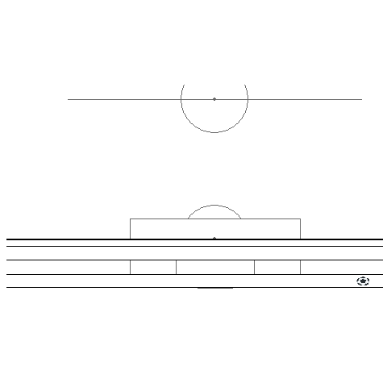

---
output: html_document
editor_options: 
  chunk_output_type: console
---

```{r setup, echo = FALSE, message = FALSE}
source("_common.R")
library(tidyverse)
library(patchwork)
library(lubridate)

# 0. 환경설정 ------
library(tidyverse)
library(rvest)
library(extrafont)
loadfonts()
# devtools::install_github("torvaney/ggsoccer")
library(ggsoccer)  
library(tweenr)    
library(gganimate) 
library(ggimage)

clean_varnames <- function(raw_data) {

  varnames <- names( raw_data )

  varnames_unicode <- map_chr(varnames, stringi::stri_escape_unicode )

  varnames_unicode_to_korean <- map_chr(varnames_unicode, stringi::stri_unescape_unicode)

  unicode_data <- raw_data %>%
    set_names(varnames_unicode_to_korean)

  unicode_data
}
```

# 러시아 월드컵 {#case-worldcup}

## 독일전 영상기록 {#russia-2018-worldcup}

러시아 월드컵 예선 마지막 독일과의 경기는 2패로 16강 탈락이 확정되었지만, 독일을 2-0으로 물리치는 감동적인 경기였다. 그럼에도 불구하고 인터넷 상에 남아 있는 영상기록은 많지 않고 SBS Sports 온라인뉴스팀 ["대한민국 VS 독일 후반 하이라이트...김영권-손흥민 골"](http://programs.sbs.co.kr/sports/fifawc/article/54896/S10009123103)에서 그나마 고화질 동영상 기록을 제공하고 있다. Tokyo R에서 **Ryo Nakagawara** 발표했던 것에 영감을 받아 독일과 월드컵 최종예선 데이터를 시각화하여 기록해서 남겨두고자 한국알사용자회에서 기여한 것이다. [^case-study-worldcup-2] [^case-study-worldcup-3] [^case-study-worldcup-4]

[^case-study-worldcup-2]: [Ryo Nakagawara, "Visualize the World Cup with R! Part 1: Recreating Goals with ggsoccer and ggplot2"](https://datascienceplus.com/visualize-the-world-cup-with-r-part-1-recreating-goals-with-ggsoccer-and-ggplot2/)

[^case-study-worldcup-3]: [Ryo Nakagawara, "Animating the Goals of the World Cup: Comparing the old vs. new gganimate and tweenr API"](https://datascienceplus.com/animating-the-goals-of-the-world-cup-comparing-the-old-vs-new-gganimate-and-tweenr-api/)

[^case-study-worldcup-4]: [Soccer ggplot - Tokyo R Meetup](https://github.com/Ryo-N7/soccer_ggplots)

| **김영권(90+2)**                                                  | **손흥민(90+6)**                                                   |
|------------------------------------|------------------------------------|
| {width="100%"} | {width="100%"} |

## 정적 시각화   {#russia-2018-worldcup-germany}

스포츠를 데이터를 통해 이해하는 첫걸음은 아마도 정적 시각화를 먼저 실행하는 것이다.
이를 위해서 먼저 해당 기록을 남기고자 하는 아이디어가 생기거나 다른 프로젝트나
뉴슬 통해 영감을 얻게 되면 공공데이터가 존재하여 해당 아이디어를 
시각화할 수 있는지 가늠하는 것이 시작이다.

### 월드컵 참가선수 명단 {#russia-2018-worldcup-germany-player}

러시아 월드컵에 참가한 선수명단은 [위키 - 2018년_FIFA_월드컵_선수_명단](https://ko.wikipedia.org/wiki/2018년_FIFA_월드컵_선수_명단) 웹페이지에서 확인이 가능하다. 이를 위해서 먼저 `rvest` 팩키지를 활용하여 정적 웹페이지를 긁어와서 데이터 정제작업을 거처 월드컵 참가 선수 명단을 확정한다.

최종 시각화에 필요한 패키지를 설치한다. [`ggsoccer`](https://torvaney.github.io/ggsoccer/)는 CRAN에도 등록되어 있어  `install.packages("ggsoccer")` 명령어나 `devtools::install_github("torvaney/ggsoccer")` 명령어로 설치한다.
2년전 초창기에는 GitHub 저장소에 공개되었고 이후 안정화를 거쳐 CRAN에 정식 등록되었다. 그밖에도 웹크롤링에 필요한 `rvest` 패키지와 애니메이션 제작에 필요한 `gganimate`, `tweenr` 패키지를 설치한다. `ggimage` 패키지는 명칭에도 나오지만 `ggplot`에 이모티콘, 아이콘, 그림 등을 넣을 수 있게 해주는 패키지다.

위키페이지에서 러시아 월드컵에 출전한 선수 주요선수를 득점 기준으로 10명 추려보자.

```{r worldcup-germany-player, eval=FALSE}

# 0. 환경설정 ------
library(tidyverse)
library(rvest)
library(extrafont)
loadfonts()
# devtools::install_github("torvaney/ggsoccer")
library(ggsoccer)  
library(tweenr)    
library(gganimate) 
library(ggimage)   


# 1. 데이터 ------
## 1.1. 월드컵 출전 선수 데이터 -----
Sys.setlocale("LC_ALL", "C")

world_url <- "https://ko.wikipedia.org/wiki/2018년_FIFA_월드컵_선수_명단"

player_dat <- world_url %>% 
    read_html() %>%
    html_nodes(xpath='//*[@id="mw-content-text"]/div/table[24]/tbody/tr/td/table') %>% 
    html_table(fill=TRUE) %>% 
    .[[1]]
 
Sys.setlocale("LC_ALL", "Korean")

player_df <- player_dat %>% 
    janitor::clean_names(ascii = FALSE) %>% 
    mutate(주장여부 = ifelse(str_detect(`선수`, "\\("), "주장", "선수")) %>% 
    mutate(`선수` = str_sub(`선수`, 1, 3))


player_df %>% 
  arrange(desc(득점)) %>% 
  slice_head(n=10)
```

### 출전선수 명단

러시아 월드컵 선수명단에 포함되었다고 독일전에 출전한 것은 아니다. 
러시아 월드컵 마지막 경기여서 앞선 경기에서 주전이였으나 부상, 경기력 부족으로 교체된 선수도 있기 때문에 
실제 독일전에 출전한 선수가 중요하다.
독일전은 2018-08-27 예선전이 열렸으며 골키퍼 조현우를 비롯한 선발선수명단이 각 포지션별로 발표되었다.

-   골키퍼: 조현우
-   수비: 이용 윤영선 김영권 홍철
-   미드필드: 이재성 정우영 장현수 문선민
-   공격: 구자철 손흥민

[Soccer event logger](https://torvaney.github.io/projects/tracker#)를 활용하여 각 선수별 위치를 축구경기장에 클릭하여 좌표를 얻은 후에 선수명을 수작업을 붙여 놓고 이를 `ggsoccer` 팩키지 `annotate_pitch()`, `theme_pitch()` 함수를 사용해서 시각화한다.

```{r worldcup-germany-lineup}
# 2. 선발 라인업 ------

lineup_df <- tribble(
    ~x, ~y, ~name,
9.035, 50.00, "조현우",
24.46, 90.78, "이용",
19.10, 66.05, "운영선",
19.10, 30.52, "김영권",
25.17,  5.52, "홍철",
46.60, 91.57, "이재성",
45.89, 66.05, "정우영",
45.53, 30.42, "장현수",
43.39,  5.52, "문선민",
71.60, 30.26, "구자철",
72.67, 64.73, "손흥민")

lineup_df %>% 
  ggplot( aes(x = x, y = y) ) +
    annotate_pitch() +
    theme_pitch(aspect_ratio = NULL) +
    coord_flip() +
    geom_point( size = 1.5 ) +
    geom_text( aes(label = name), family="NanumGothic",
               vjust = 1.5, color = "blue")

```

### 독일전 골모음 {#russia-2018-worldcup-germany-goal}

정규 경기시간이 모두 소진된 후에 추가시간이 6분 주워졌고, 추가시간 2분 손흥민의 코너킥이 김영권에 이어지면서 독일전 첫골이 완성되었다. 축구장 골의 움직임은 `ball_df` 데이터프레임에 2차원 평면이라 `from`, `to`로 `x`, `y` 각각 데이터화시킨다. 축구선수의 위치는 `first_player_df` 데이터프레임의 첫번째 골에 관여한 선수 위치를 담아낸다.
선수의 위치는 `geom_point()`, 공의 움직임은 `geom_segment()`로 나타내고 첫번째 골의 이동에 집중할 수 있도록 관련된 부분을 정리하고 점위에 텍스트를 추가하여 선수명을 명확히 한다.


```{r germany-first-goal}
# 1. 첫번째 골 데이터 ------

ball_df <- tribble(~from_x, ~from_y, ~to_x, ~to_y, 
                      0,    100,   6.78, 63.94,
                      6.78, 63.94, 7.5,  56.84,
                      7.5,  56.84, 4.64, 38.94,
                      4.64, 38.94, -0.53,47.36)

first_player_df <- tribble(~x, ~y, ~name, 
                   0,    100,   "손흥민",
                   6.78, 63.94, "이승우",
                   7.5,  56.84, "윤영선",
                   4.64, 38.94, "김영권")

ball_df %>% 
  ggplot() +
    annotate_pitch() +
    geom_point(aes(x=from_x, y=from_y, size=1.5, color="red")) +  
    geom_point(aes(x=to_x, y=to_y, size=1.5, color="red")) +
    geom_segment(aes(x = from_x, y = from_y, xend = to_x, yend = to_y),
                 arrow = arrow(length = unit(0.25, "cm"),
                               type = "closed")) +
    theme_pitch() +
    coord_flip() +
    xlim(-10, 51) +
    ylim(-15, 101) +
    labs(title="한국과 독일 월드컵 예선", 
         subtitle="김영권 첫골(90+2)") +
    theme(legend.position = "none") +
    geom_text(data=first_player_df, 
        aes(x = x, y = y, label = name, family=c("NanumGothic")),
        vjust = -1.5, color = "blue")
```

독일전 두번째 골은 연장 추가시간 막판 골키퍼까지 나와 만회골을 위해 혼신을 다하던 순간, 주세종이 골을 뽑아내고 이를 손흥민에 연결하여 여유있게 골을 골망에 넣어 두번째골이 완성되었다. 앞선방법과 동일하게 두번째 골도 공의 위치와 선수를 데이터프레임에 담아내고 `ggplot`으로 시각화한다.

```{r germany-second-goal}
# 2. 두번째 골 데이터 ------

second_ball_df <- tribble(~from_x, ~from_y, ~to_x, ~to_y, 
                   69.28, 15.52, 75.89, 22.89,
                   75.89, 22.89, 24.28, 62.89,
                   24.28, 62.89, 2.85, 60.52,
                   2.85, 60.52, -1.07, 46.31)

second_player_df <- tribble(~x, ~y, ~name, 
                           69.28, 15.52, "주세종",
                           24.28, 62.89, "손흥민")

second_ball_df %>% 
  ggplot() +
    annotate_pitch() +
    geom_point(aes(x=from_x, y=from_y, size=1.5, color="red")) +
    geom_point(aes(x=to_x, y=to_y, size=1.5, color="red")) +
    geom_segment(aes(x = from_x, y = from_y, xend = to_x, yend = to_y),
                 arrow = arrow(length = unit(0.25, "cm"),
                               type = "closed")) +
    theme_pitch() +
    coord_flip() +
    xlim(-10, 101) +
    ylim(-15, 101) +
    labs(title="한국과 독일 월드컵 예선", 
         subtitle="손흥민 두번째골(90+6)") +
    theme(legend.position = "none") +
    geom_text(data=second_player_df, 
              aes(x = x, y = y, label = name, family=c("NanumGothic")),
              vjust = -1.5, color = "blue")


```

## 동적 시각화 {#russia-2018-worldcup-germany-ani}

`ggplot`을 활용한 동적 시각화는 기본적으로 정적 시각화 `ggplot` 그래프를 생성하고 나서 이를
애니메이션을 원하면 `gganimate`, 인터랙티브 그래프를 원하면 `plotly` 패키지에 연결시키는 것이 일반적이다.

선수의 위치와 골의 이동경로를 설정하고 `time` 순서를 지정한다. 그리고 나서, `gganimate` 팩키지 `transition_states()` 함수를 사용해서 득점장면 애니메이션을 생성시킨다.

### 김영권 첫번째 골 {#russia-2018-worldcup-germany-player-first}

독일전 첫번째 골의 경우 손흥민 코너킥으로 선수의 움직임이 크지 않은 상태에서 공이 손흥민 &rarr; 이승우 &rarr; 윤영선 &rarr; 김영권으로 연결되며 골로 연결된 경우다. 따라서 골의 움직임만 `time`을 주어 이동시키면 애니메이션을 간단히 제작할 수 있다.

```{r first-goal-animation, eval = FALSE}
# 1. 첫번째 골 데이터 ------

first_ball_df <- tribble(~x,      ~y,  ~time,
                         0,      100,   1,
                         6.78, 67.94,   2,
                         7.5,  56.84,   3,
                         4.64, 38.94,   4,
                         -0.8,	47,   5)

first_player_df <- tribble(~x, ~y, ~name, 
                           0,    100,   "손흥민",
                           9.78, 67.94, "이승우",
                           9.5,  56.84, "윤영선",
                           7.64, 38.94, "김영권")

first_goal_ani <- first_ball_df %>% 
  ggplot() +
    annotate_pitch() +
    theme_pitch() +
    coord_flip() +
    xlim(-10, 51) +
    ylim(-15, 101) +
    labs(title="한국과 독일 월드컵 예선", 
         subtitle="김영권 첫번째골(90+2)") +
    geom_label(data = first_player_df, aes(x = x, y = y, label = name), family = "NanumGothic") +
    theme(legend.position = "none",
          text = element_text(family = "NanumGothic")) +
    ggimage::geom_emoji(
        aes(x = x, 
            y = y),
        image = "26bd", size = 0.035) +
    transition_states(
        time,
        transition_length = 0.5,
        state_length = 0.0001,
        wrap = FALSE) +
    ease_aes("linear")

animate(first_goal_ani, nframes = 24, renderer = gifski_renderer("assets/images/first_goal.gif"))

```



### 손흥민 두번째 골 {#russia-2018-worldcup-germany-player-second}

두번째 손흥민의 골은 주세종이 독일 골키퍼로부터 공을 가로채서 이를 손흥민에 연결하고 손흥민이 빠른 주력을 이용하여 골대까지 전력질주하여 골을 넣은 경우라, 공뿐만 아니라 선수의 움직임도 함께 애니메이션화하여 시각화한다.

```{r second-goal-animation, eval = FALSE}
# 2. 두번째 골 데이터 ------

second_ball_df <- tribble(~x, ~y, ~time,
                          69.28, 15.52, 1,
                          75.89, 22.89, 2,
                          24.28, 62.89, 3,
                          24.28, 62.89, 4,
                          2.85, 60.52,  5,
                          -1.07, 46.31, 6)

sohn_movement_df <- tribble(~x, ~y, ~time, ~name,
                            35.28, 62.89, 1, "손흥민",
                            35.28, 62.89, 2, "손흥민",
                            35.28, 62.89, 3, "손흥민",
                            24.28, 62.89, 4, "손흥민",
                             2.85, 60.52, 5, "손흥민",
                             2.85, 60.52, 6, "손흥민")

joo_movement_df <- tribble(~x, ~y, ~time, ~name,
                           69.28, 15.52, 1, "주세종",
                           75.89, 22.89, 2, "주세종",
                           75.89, 22.89, 3, "주세종",
                           75.89, 22.89, 4, "주세종",
                           75.89, 22.89, 5, "주세종",
                           75.89, 22.89, 6, "주세종")

second_goal_ani <- second_ball_df %>% 
  ggplot() +
    annotate_pitch() +
    theme_pitch() +
    coord_flip() +
    xlim(-10, 101) +
    ylim(-15, 101) +
    labs(title="한국과 독일 월드컵 예선", 
         subtitle="손흥민 두번째골(90+6)") +
    theme(legend.position = "none") +
    geom_label(data = joo_movement_df, aes(x = x, y = y, label = name)) +
    geom_label(data = sohn_movement_df, aes(x = x, y = y, label = name)) +
    theme(text = element_text(family = "NanumGothic")) +
    ggimage::geom_emoji(
        aes(x = x, 
            y = y),
        image = "26bd", size = 0.035) +
    transition_states(
        time,
        transition_length = 0.5,
        state_length = 0.0001,
        wrap = FALSE) +
    # transition_manual(frames = time)
    ease_aes("quadratic-out")

animate(second_goal_ani, nframes = 24, renderer = gifski_renderer("assets/images/second_goal.gif"))

```


