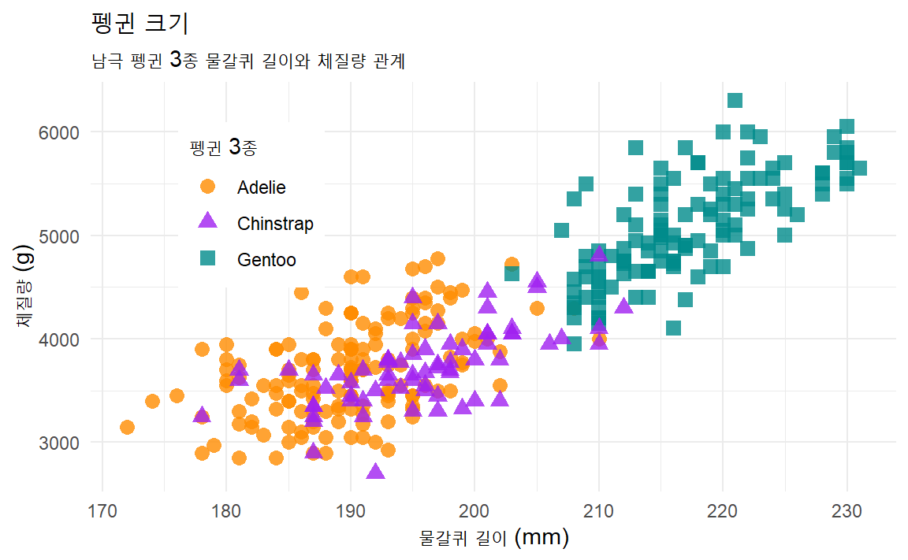

# 준비된 데이터 {#ggplot-datasets}

시각화 작업을 할 때 가장 문제되는 것 중 하나가 원천데이터다. 데이터가 깔끔하게 
준비되어 있으면 시각화 업무에 집중하여 놀라운 성과물을 낼 수 있다. 반면에 데이터가
엉망진창인 경우 시각화 범위도 축소되고 시각화 각 단계를 건널 때마다 
문제를 해결해 가면서 시각화 작업을 수행하게 되어 노력대비 기대한 산출물을 얻을
가능성은 낮아진다.

데이터 사이언스와 시각화의 예제 데이터로 가장 많이 추천되는 것이 
[갭마인더(`gapminder`)](https://github.com/jennybc/gapminder)와 [팔머펭귄(`palmerpenguins`)](https://allisonhorst.github.io/palmerpenguins/) 데이터셋이다.
두 데이터셋 모두 CRAN에 등록된 공식 데이터 패키지다.

## 팔머 펭귄 {#palmer-penguins}

미국에서 "George Floyd"가 경찰에 의해 살해되면서 촉발된 ["Black Lives Matter"](https://ko.wikipedia.org/wiki/Black_Lives_Matter) 운동은 아프리카계 미국인을 향한 폭력과 제도적 인종주의에 반대하는 사회운동이다. 

데이터 과학에서도 최근 R.A. Fisher의 과거 저술한 "The genetical theory of natural selection" [@fisher1958genetical] 우생학(Eugenics) 대한 관점이 논란이 되면서 R 데이터 과학의 첫 데이터셋으로 붓꽃 `iris` 데이터를 다른 데이터, 즉 펭귄 데이터로 대체하는 움직임이 활발히 전개되고 있다. [`palmerpenguins`](https://github.com/allisonhorst/palmerpenguins) 데이터셋이 대안으로 많은 호응을 얻고 있다.

### 펭귄 공부 {#penguins-study}

팔머(Palmer) 펭귄은 3종이 있으며 자세한 내용은 다음 링크된 나무위키에서 참조 가능하다.

- [젠투 펭귄(Gentoo Penguin)](https://namu.wiki/w/젠투펭귄): 머리에 모자처럼 둘러져 있는 하얀 털 때문에 알아보기가 쉽다. 암컷이 회색이 뒤에, 흰색이 앞에 있다. 펭귄들 중에 가장 빠른 시속 36km의 수영 실력을 자랑하며, 짝짓기 할 준비가 된 펭귄은 75-90cm까지도 자란다.
- [아델리 펭귄(Adelie Penguin)](https://namu.wiki/w/아델리펭귄): 프랑스 탐험가인 뒤몽 뒤르빌(Dumont D’Urville) 부인의 이름을 따서 ‘아델리’라 불리게 되었다. 각진 머리와 작은 부리 때문에 알아보기 쉽고, 다른 펭귄들과 마찬가지로 암수가 비슷하게 생겼지만 암컷이 조금 더 작다.
- [턱끈 펭귄(Chinstrap Penguin)](https://namu.wiki/w/턱끈펭귄): 언뜻 보면 아델리 펭귄과 매우 비슷하지만, 몸집이 조금 더 작고, 목에서 머리 쪽으로 이어지는 검은 털이 눈에 띈다. 어린 고삐 펭귄들은 회갈색 빛을 띄는 털을 가지고 있으며, 목 아래 부분은 더 하얗다. 무리를 지어 살아가며 일부일처제를 지키기 때문에 짝짓기 이후에도 부부로써 오랫동안 함께 살아간다.


{width="100%"}

다음으로 `iris` 데이터와 마찬가지로 펭귄 3종을 구분하기 위한 변수로 조류의 부리에 있는 중앙 세로선의 융기를 지칭하는 능선(`culmen`) 길이(culmen length)와 깊이(culmen depth)를 이해하면 된다.


### 데이터셋 설치 {#penguin-install-dataset}

CRAN에 등록되어 있어 `install.packages()` 함수로 직접 설치해도 되고,
`remotes` 팩키지 `install_github()` 함수로 GitHub 저장소의 팔머펭귄 데이터를 설치해도 된다.
정식 CRAN에 등록되기 이전에 GitHub에 먼저 등록되어 몇년간 정제과정을 거쳐 초기부터 사용하신 분은
GitHub 저장소 설치가 편할 수 있다. 안정화 되었기 때문에 CRAN 데이터나 GitHub 데이터나 이제 차이는 없다.


도서관에서 책을 꺼내 열람실에서 살펴보듯이 설치된 `palmerpenguins` 데이터셋을
`library(palmerpenguins)` 함수로 불러온다. 책에 어떤 내용이 담겼는지 살펴보듯이
 `tidyverse`를 구성하는 `dplyr` 패키지 `glimpse()` 함수로 펭귄 데이터를 일별한다.


```
## Rows: 344
## Columns: 8
## $ species           <fct> Adelie, Adelie, Adelie, Adelie, Adelie, Adelie, Adel…
## $ island            <fct> Torgersen, Torgersen, Torgersen, Torgersen, Torgerse…
## $ bill_length_mm    <dbl> 39.1, 39.5, 40.3, NA, 36.7, 39.3, 38.9, 39.2, 34.1, …
## $ bill_depth_mm     <dbl> 18.7, 17.4, 18.0, NA, 19.3, 20.6, 17.8, 19.6, 18.1, …
## $ flipper_length_mm <int> 181, 186, 195, NA, 193, 190, 181, 195, 193, 190, 186…
## $ body_mass_g       <int> 3750, 3800, 3250, NA, 3450, 3650, 3625, 4675, 3475, …
## $ sex               <fct> male, female, female, NA, female, male, female, male…
## $ year              <int> 2007, 2007, 2007, 2007, 2007, 2007, 2007, 2007, 2007…
```

### 자료구조 일별 {#penguin-EDA-skimr}

[`skimr`](https://cran.r-project.org/web/packages/skimr/) 패키지를 사용해서 
`penguins` 데이터프레임 자료구조를 일별한다.
이를 통해서 344개 펭귄 관측값이 있으며, 7개 칼럼으로 구성된 것을 확인할 수 있다.
또한, 범주형 변수가 3개, 숫자형 변수가 4개로 구성되어 있다. 
그외 더 자세한 사항은 범주형, 숫자형 변수에 대한 요약 통계량을 참조한다.


Table: (\#tab:penguins-EDA-data-structure)Data summary

|                         |         |
|:------------------------|:--------|
|Name                     |penguins |
|Number of rows           |344      |
|Number of columns        |8        |
|_______________________  |         |
|Column type frequency:   |         |
|factor                   |3        |
|numeric                  |5        |
|________________________ |         |
|Group variables          |None     |


**Variable type: factor**

|skim_variable | n_missing| complete_rate|ordered | n_unique|top_counts                  |
|:-------------|---------:|-------------:|:-------|--------:|:---------------------------|
|species       |         0|          1.00|FALSE   |        3|Ade: 152, Gen: 124, Chi: 68 |
|island        |         0|          1.00|FALSE   |        3|Bis: 168, Dre: 124, Tor: 52 |
|sex           |        11|          0.97|FALSE   |        2|mal: 168, fem: 165          |


**Variable type: numeric**

|skim_variable     | n_missing| complete_rate|   mean|     sd|     p0|    p25|    p50|    p75|   p100|hist  |
|:-----------------|---------:|-------------:|------:|------:|------:|------:|------:|------:|------:|:-----|
|bill_length_mm    |         2|          0.99|   43.9|   5.46|   32.1|   39.2|   44.5|   48.5|   59.6|▃▇▇▆▁ |
|bill_depth_mm     |         2|          0.99|   17.1|   1.97|   13.1|   15.6|   17.3|   18.7|   21.5|▅▅▇▇▂ |
|flipper_length_mm |         2|          0.99|  200.9|  14.06|  172.0|  190.0|  197.0|  213.0|  231.0|▂▇▃▅▂ |
|body_mass_g       |         2|          0.99| 4201.8| 801.95| 2700.0| 3550.0| 4050.0| 4750.0| 6300.0|▃▇▆▃▂ |
|year              |         0|          1.00| 2008.0|   0.82| 2007.0| 2007.0| 2008.0| 2009.0| 2009.0|▇▁▇▁▇ |

데이터가 크지 않아 인터랙티브 `reactive`, `DT` 패키지를 통해 전체 데이터를 살펴볼 수도 있고,
첫 10개 관측점만 뽑아 일별할 수도 있다.


```
## # A tibble: 10 × 8
##   species island bill_length_mm bill_depth_mm flipper_length_… body_mass_g sex  
##   <fct>   <fct>           <dbl>         <dbl>            <int>       <int> <fct>
## 1 Adelie  Torge…           39.1          18.7              181        3750 male 
## 2 Adelie  Torge…           39.5          17.4              186        3800 fema…
## 3 Adelie  Torge…           40.3          18                195        3250 fema…
## 4 Adelie  Torge…           NA            NA                 NA          NA <NA> 
## 5 Adelie  Torge…           36.7          19.3              193        3450 fema…
## 6 Adelie  Torge…           39.3          20.6              190        3650 male 
## # … with 4 more rows, and 1 more variable: year <int>
```


### 탐색적 데이터 분석 {#penguin-EDA}

`palmerpenguins` 데이터셋 소개에 포함되어 있는 미국 팔머 연구소 (palmer station) 
펭귄 물갈퀴(flipper) 길이와 체질량(body mass) 산점도를 그려보자.
그래프 문법에 따라 `x`, `y` 축을 데이터프레임 변수로 매핑하고 
산점도의 각 펭귄 물갈퀴 길이(`flipper_length_mm`)와 체질량(`body_mass_g`)은 
펭귄 종에 따라 `geom_point()`로 색상과 모양을 달리한다.



## 갭마인더 {#gapminder}

'팩트풀니스'(Factfullness)는 '사실충실성'으로 번역되고 팩트(사실)에 근거해 세계를 바라보고 이해하는 태도와 관점을 의미하는 것으로 얼마전 타계한 한스 로슬링의 마지막 저서 "Factfulness"의 책제목으로 더 유명하다. 저자는 세계에 관한 심각한 무지와 싸움을 평생의 사명으로 삼아 다양한 업적을 남겼으며 데이터 시각화를 통해 그동안 보지 못했던 사실을 일반인이면 누구나 쉽게 이해하고 의사결정을 빠른 시간내에 내릴 수 있도록 도움을 주였다. 그가 남긴 업적중의 하나는 데이터로 통상 `gapminder` 로 알려져 있으며 제니 브라이언트 박사가 R 데이터 패키지로 제작하여 쉽게 다가설 수 있게 되었다. `gapminder` 데이터는 시각화는 물론 애니메이션 시각화의 예제로도 많이 사용되고 있다.

갭마인더 데이터셋은 1952년부터 5년 간격으로 2007년까지 142개 국가 인구수, 기대수명(`lifeExp`), 인구수(`pop`),
1인당 국민소득(`gdpPercap`)에 대한 정보를 담고 있어 기대수명과 1인당 국민소득을 통해 1952년부터 국가별 발전사항 다른 관점으로 불평등에 대한 사실을 시각화를 통해 직시할 수 있다.


### 데이터셋 설치 {#gapminder-install-dataset}

CRAN에 등록되어 있어 `install.packages()` 함수로 직접 설치해도 되고,
`remotes` 팩키지 `install_github()` 함수로 GitHub 저장소의 갭마인더 데이터를 설치해도 된다.
팔머 펭귄 데이터와 마찬가지로 안정화 되었기 때문에 CRAN 데이터나 GitHub 데이터나 이제 차이는 없다.


### 자료구조 일별 {#gapminder-EDA-skimr}

[`skimr`](https://cran.r-project.org/web/packages/skimr/) 패키지를 사용해서 
`gapminder` 데이터프레임 자료구조를 일별한다.
이를 통해서 1,704개 펭귄 관측값이 있으며, 6개 칼럼으로 구성된 것을 확인할 수 있다.
또한, 범주형 변수가 2개, 숫자형 변수가 4개로 구성되어 있다. 
그외 더 자세한 사항은 범주형, 숫자형 변수에 대한 요약 통계량을 참조한다.


Table: (\#tab:gapminder-EDA-data-structure)Data summary

|                         |          |
|:------------------------|:---------|
|Name                     |gapminder |
|Number of rows           |1704      |
|Number of columns        |6         |
|_______________________  |          |
|Column type frequency:   |          |
|factor                   |2         |
|numeric                  |4         |
|________________________ |          |
|Group variables          |None      |


**Variable type: factor**

|skim_variable | n_missing| complete_rate|ordered | n_unique|top_counts                             |
|:-------------|---------:|-------------:|:-------|--------:|:--------------------------------------|
|country       |         0|             1|FALSE   |      142|Afg: 12, Alb: 12, Alg: 12, Ang: 12     |
|continent     |         0|             1|FALSE   |        5|Afr: 624, Asi: 396, Eur: 360, Ame: 300 |


**Variable type: numeric**

|skim_variable | n_missing| complete_rate|     mean|       sd|      p0|      p25|      p50|      p75|     p100|hist  |
|:-------------|---------:|-------------:|--------:|--------:|-------:|--------:|--------:|--------:|--------:|:-----|
|year          |         0|             1| 1.98e+03| 1.73e+01|  1952.0| 1.97e+03| 1.98e+03| 1.99e+03| 2.01e+03|▇▅▅▅▇ |
|lifeExp       |         0|             1| 5.95e+01| 1.29e+01|    23.6| 4.82e+01| 6.07e+01| 7.08e+01| 8.26e+01|▁▆▇▇▇ |
|pop           |         0|             1| 2.96e+07| 1.06e+08| 60011.0| 2.79e+06| 7.02e+06| 1.96e+07| 1.32e+09|▇▁▁▁▁ |
|gdpPercap     |         0|             1| 7.22e+03| 9.86e+03|   241.2| 1.20e+03| 3.53e+03| 9.33e+03| 1.14e+05|▇▁▁▁▁ |

데이터가 크지 않아 인터랙티브 `reactive`, `DT` 패키지를 통해 전체 데이터를 살펴볼 수도 있고,
첫 10개 관측점만 뽑아 일별할 수도 있다.


```
## # A tibble: 10 × 6
##   country     continent  year lifeExp      pop gdpPercap
##   <fct>       <fct>     <int>   <dbl>    <int>     <dbl>
## 1 Afghanistan Asia       1952    28.8  8425333      779.
## 2 Afghanistan Asia       1957    30.3  9240934      821.
## 3 Afghanistan Asia       1962    32.0 10267083      853.
## 4 Afghanistan Asia       1967    34.0 11537966      836.
## 5 Afghanistan Asia       1972    36.1 13079460      740.
## 6 Afghanistan Asia       1977    38.4 14880372      786.
## # … with 4 more rows
```

### 탐색적 데이터 분석 {#gapminder-EDA}

`gapminder` 데이터셋에서 `dplyr` 패키지 `filter()` 함수를 이용하여 대륙명이 오세아니아를
제외하고 나머지 대륙(아프리카, 아메리카, 아시아, 유럽)에 속한 
국가를 색상을 달리하여 각 국가별로 연도별 기대수명의 변화를 시각화한다.


