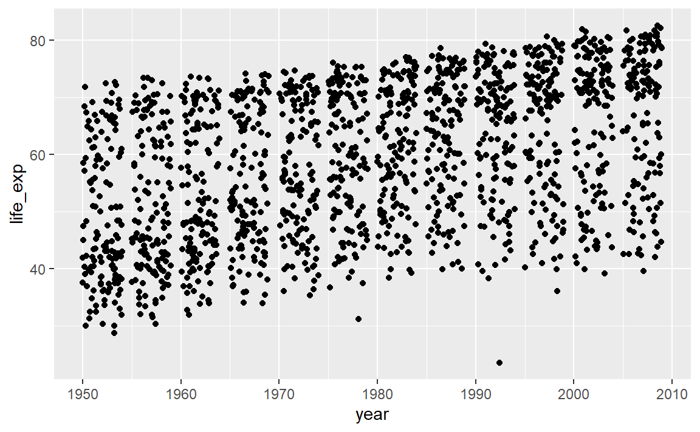
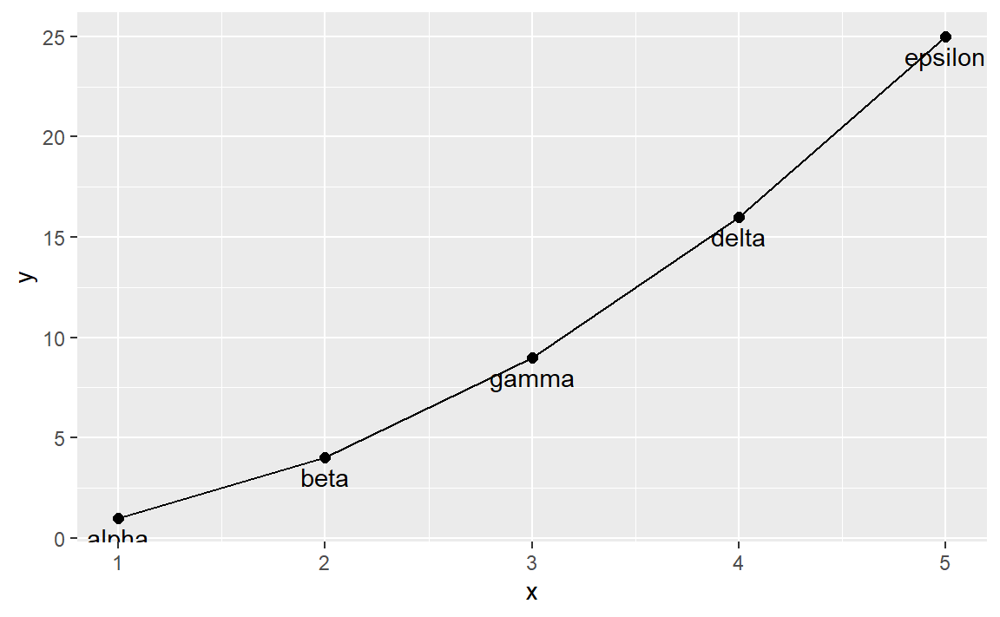
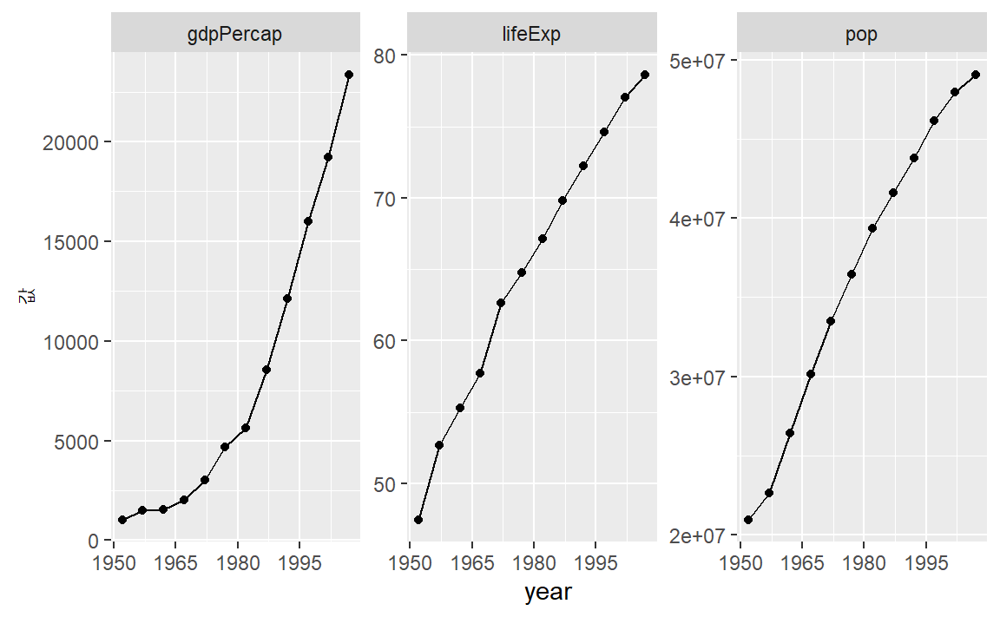

# 행복한 시각화 {#happy-viz}

캐나다 브리티쉬 콜럼비아 대학 [STAT545](https://stat545.com/) 교육과정이 공개되어 
초창기 데이터 과학이 정립될 때 큰 역할을 하였다. 
"행복한 시각화 생활을 위한 비밀" 장에 성공적인 시각화를 핵심적인 내용이 담겨있다.

시각화 그래프를 제작하는데 어려움이 있다면, 
`ggplot2` 코드에 문제가 있다고 시각화 관련 부분에 집중적인 시간을 투여할 것이다.
하지만 다음 세가지 지점을 먼저 살펴봐라.

- 데이터프레임에 시각화 관련 작업을 담아둔다.
- 데이터프레임을 *깔끔하게(tidy)* 제작한다; 시각화에 적절한 자료형으로 변환
- 범주형(factor) 변수를 적절히 활용함은 물론 범주형 자료 장인이 된다.

나중에 심도있게 다룰 시각화 자료구조인 깔끔한 **데이터(Tidy Data)**를 제작하게 되면
그동안 자신을 괴롭혔던 시각화 관련 문제는 자연히 사라져 버린다.
이를 위해서 `dplyr` 패키지의 데이터 다루는 여러 동사를 `tidyr` 패키지
깔끔한 데이터 제작 동사와 결합하여 사용하게 되면 생산성을 크게 높일 수 있다.

## 시각화 입력 자료구조: 데이터프레임 {#viz-secret-dataframe}

기억해야 할 단 한가지 사항은 시각화 자료구조는 데이터프레임이다. 
좀더 구체적으로 **깔끔한 데이터**다. 
시각화 산출물을이 동일하다고 하더라도 작성한 코드를 면밀히 살펴보면
가독성이 떨어짐은 물론 `tidyverse` 관습과 동떨어진 경우를 종종 보게 된다.

예를 들어, 많은 경우 변수가 데이터프레임 밖에 복사되어 
작업공간에 독립된 객체로 존재시켜 이를 시각화하는 것이다.


```r
library(gapminder)
life_exp <- gapminder$lifeExp
year <- gapminder$year
```

앞선 방식의 문제는 `ggplot2` 패키지로 시각화가 되지 않고 오류가 발생된다.
근본 원인은 `ggplot2` 패키지 `ggplot()` 함수가 입력값이 데이터프레임이라는데 있다.
즉, 데이터프레임을 입력받아 시각화 그래프를 출력으로 뱉어내는데 이를 충족시키지 못할 경우
의도한 바가 컴퓨터에 전달되지 않아 오류가 나와 더이상 진전을 이룰 수가 없다.


```r
library(ggplot2)
ggplot(aes(x = year, y = life_exp)) + 
  geom_jitter()
```

즉, 변수를 데이터프레임에 담아 보관하고 `ggplot()` 함수에 시각화 대상 데이터프레임에 전달하면 된다.
이런 전략은 R에 존재하는 다른 시각화 플랫폼에도 동일하게 적용된다.
R에는 `ggplot`을 비롯하여 Base 그래픽, `lattice` 그래픽 등 크게 3가지가 존재한다.
모두 방식에는 다소 차이가 있지만 근본적으로 데이터프레임을 입력받아 시각화 그래프를 출력으로 내보낸다.

파이프 연산자를 사용해서 좀더 직관적으로 코드를 다음과 같이 제작하게 되면 
의미가 명확해질 것이다.


```r
library(tidyverse)
gapminder %>% 
  ggplot(aes(x = year, y = life_exp)) + 
  geom_jitter()
```



예를 들어 시각화 대상이 국가별, 대륙별, 년도별 데이터를 필터링하는 경우도 있다.
관련 모든 변수가 데이터프레임에 있게되면 훨씬 더 쉽고 안전하게 작업을 수행할 수 있다.
앞서 시각화 변수를 별도 작업공간(메모리)에 별도 저장하여 관리할 경우 대비하여 
생각하게 되면 데이터프레임에 시각화 모든 정보를 담아두는 전략의 명확한 우위가 드러난다.

`ggplot2` 시각화 시스템만 데이터프레임을 받아 시각화하는 유일한 특이한 사례는 아니다.
데이터프레임에 모든 정보를 담아두고 필요한 경우 `dplyr` 동사로 변수생성, 필터링,
그룹별 요약, 정렬 등 데이터 조작 작업을 통해 시각화 대상 데이터프레임을 만들고 
이를 시각화하는 전략은 널리 인정되는 모범사례다.

데이터프레임을 `data=` 선택옵션으로 전달하는 것이 많이 사용되는 R 함수에 일반적인 기능이다.
예를 들어, `lm()`, `aggregate()`, `plot()`, `t.test()`. 
따라서, 이런 방식이 기본디폴트 작업방식이 된다.


## `dplyr::data_frame()` 자료구조 {#viz-secret-explicit-dataframe}

데이터는 이미 있는데 데이터프레임이 아니라면, 
"왜 데이터프레임이 아닌가?" 라고 본인에게 질문을 던진다.
시각화 대상 변수는 생성했는가? 
필요한 변수를 먼저 데이터프레임에 반영해 둬야 할 것이다.
`dplyr` 팩키지에 `data_frame()` 신규 함수는 내장된 `data.frame()` 함수에 대한 개선된 버젼이다.
데이터프레임을 시각화 자료구조로 채택하게 되면 
다른 변수를 정의할 수 있고, 강제변환으로 인한 데이터 훼손도 방지할 수 있다.
구체적으로 말하면, 문자열은 명시적으로 지정하지 않게 되면 요인으로 변환되지 않는다.
이것만으로도 데이터프레임과 연관된 문제를 회피할 수 있다.

데이터프레임에 변수를 새로 추가하는 `dplyr::mutate()` 함수를 통해, 동일한 길이를 갖는
연관된 변수를 처리할 자동으로 데이터프레임 내부에서 처리하여 반영한다.


```r
library(tidyverse)
my_dat <- data_frame(x = 1:5,
             y = x ^ 2,
             text = c("alpha", "beta", "gamma", "delta", "epsilon"))

glimpse(my_dat)
```

```
## Rows: 5
## Columns: 3
## $ x    <int> 1, 2, 3, 4, 5
## $ y    <dbl> 1, 4, 9, 16, 25
## $ text <chr> "alpha", "beta", "gamma", "delta", "epsilon"
```

```r
ggplot(my_dat, aes(x, y)) + 
  geom_line() + 
  geom_text(aes(label = text), vjust = 1.5) +
  geom_point(size = 2)
```



## 다른 접근방식 `with()` {#viz-secret-with}

데이터프레임을 시각화 입력으로 삼는 전략의 우수성을 기존 다른 접근법과 비교해보자.
슬프게도 모든 함수가 `data=` 인자를 제공하지는 않는다.
상관계수를 계산하는 `cor()` 함수를 예로 들어보자. 다음 코드는 동작하지 않는다:


```r
cor(year, lifeExp, data = gapminder)
# Error in cor(year, lifeExp, data = gapminder) : 
#  unused argument (data = gapminder)
```

물론 다음과 같이 데이터프레임 명칭을 항상 반복하면 원하는 결과를 얻을 수 있다.


```r
cor(gapminder$year, gapminder$lifeExp)
```

```
## [1] 0.436
```

하지만, `gapminder`를 두번 타이핑하게 되어 중복 반복 작업이 있어
사람들이 싫어한다. 아마도 이렇게 `gapminder`를 반복적으로 타이핑한다는 의식속에 숨겨진 공포가 
작업공간에 독립된 객체에 변수를 복사하게 만든 동기가 되지 않았나 싶다.

`with()` 함수가 이런 문제를 피해나가는 해결책이 된다.
데이터프레임을 첫번째 인자로 넣는다.
두번째 인자는 특별히 격리된 환경에서 평가되는 표현식이 된다.
명령어 한줄 혹은 여러줄로 된 토막 코드가 될 수도 있다.
특별한 점은 데이터프레임에 변수를 이름으로 참조할 수 있다는 것이다.


```r
with(gapminder,
     cor(year, lifeExp))
```

```
## [1] 0.436
```

`magrittr` 팩키지를 사용하게 되면, 또다른 선택욥션이 `%$%` 연산자를 사용해서 데이터프레임 내부 변수를 노출시켜 향후 연산작업을 진행해 나가는 방식도 있다. 참고로 `magrittr` 패키지의 영감을 얻어
`tiydverse` 생태계를 연결하는 `%>%` 이 생겨났다.


```r
library(magrittr)
gapminder %$%
  cor(year, lifeExp)
```

```
## [1] 0.436
```

## 사례 {#viz-secret-case-study}

특정한 국가 예를 들어 한국을 뽑아 연도별로 모든 정량적 변수를 도식화한다.

본능적으로 먼저 `gapminder` 데이터에서 한국을 뽑아 변수별로 루프를 돌려서
개별적으로 그림을 그리고 이를 한데 묶는다.
사실 이러한 방식으로도 작업을 수행할 수 있다.
하지만, 데이터 형태를 바꾸는 방식이 루프를 돌리는 것보다 현재 R 생태계를 고려하면 좀더 "R스럽다".

### 데이터 형태 바꾸기 {#viz-secret-case-study-data}

먼저 `gapminder` 데이터에서 한국만 뽑아낸다.
그리고 나서 `pop`, `lifeExp`, `gdpPercap` 변수를 `var` 동반변수를 키로 
`value` 변수를 값으로 하여 변수하나로 `gather()`함수를 통해 모은다. 


```r
korea_dat <- gapminder %>%
  filter(country == "Korea, Rep.")

korea_tidy <- korea_dat %>%
  pivot_longer(cols = c(pop, lifeExp, gdpPercap), names_to = "변수", values_to = "값")

dim(korea_dat)
```

```
## [1] 12  6
```

```r
dim(korea_tidy)
```

```
## [1] 36  5
```

필터링된 `korea_dat`는 12 행을 갖는다. 
`korea_tidy` 데이터프레임에 변수를 세개 모아 쌓아서, 행의 갯수가 3 배 되는 것이 이해된다.
즉, 폭이 넓은 데이터를 길이가 긴 데이터로 바꿔서 36 행을 갖는다.

### `facet` 기능으로 변수를 반복 {#viz-secret-case-study-facet}

데이터가 깔끔한 데이터프레임에 반복을 돌릴 수 있는 변수를 나타내는 적절한 요인으로 구성되어서,
`facet` 기능을 구현하기만 하면 된다.


```r
p <- korea_tidy %>% 
  ggplot( aes(x = year, y = 값) ) +
    facet_wrap(~ 변수, scales="free_y") 

p + geom_point() + geom_line() +
  scale_x_continuous(breaks = seq(1950, 2011, 15))
```



### 요약 {#viz-secret-summary}

한국을 뽑아 시각화한 코드가 다음에 요약되어 있다.


```r
gapminder %>%
  ## 데이터프레임 데이터 조작: `dplyr`
  filter(country == "Korea, Rep.") %>%
  ## 시각화를 위한 깔끔한 데이터: `tidyr`
  pivot_longer(cols = c(pop, lifeExp, gdpPercap), names_to = "변수", values_to = "값") %>% 
  ## 그래프 문법에 따른 시각화: `ggplot`
  ggplot(aes(x = year, y = 값)) +
    facet_wrap(~ 변수, scales="free_y") +
    geom_point() + 
    geom_line() +
    scale_x_continuous(breaks = seq(1950, 2011, 15))
```

앞에서 언급한 규칙에서 나온 이득을 상기 토막 코드가 보여주고 있다.

- 한국만 `dplyr` 패키지 `filter()` 함수 데이터 조작을 통해 시각화 **데이터프레임**으로 독립.
- 데이터를 **폭넓은(wide) &rarr; 긴(long)** 형태로 바꾼 전형적인 **깔끔화** 사례.
    - 칼럼 세개를 칼럼 한개로 모으는데 이유는 그림에 `y`-축에 각 변수를 도식화에 용이.
- 각 작은 그림(facet)에 속한 관측점을 구별하는데 **범주**(`변수`)을 사용하고 나서, 패싯 기능 적용.

