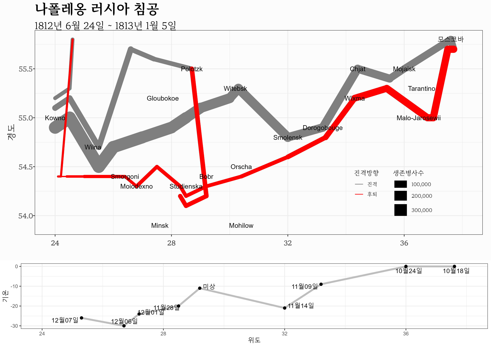

# 헬로우 월드 {#hello-world}

## 나폴레옹 러시아 침공 {#napoleon-invasion}

나폴레옹 황제가 프랑스를 통치할 때 1812년 최대 전성기를 구가했다. 

{width=100%}

최대 전성기를 구가하던 1812년 나폴레옹은 러시아 침공을 감행했다. 나폴레옹의 
러시아침공은 데이터 시각화의 역작을 남기는 계기가 되기도 했다. 
미나르는 프랑스의 러시아 침공을 군더더기 없이 시작부터 폐퇴하여 돌아온 과정까지 간략하게 표현했다. 

{width=100%}

미나르 데이터 시각화의 지명을 자세히 보면 프랑스의 러시아 침공에 대해 대략적으로 
인식하고 있는 것과 다소 차이가 난다. 통상 프랑스 수도 파리에서 나폴레옹 대군이 
출발하여 러시아 모스코바에서 한동안 머물다가 다시 수도 파리로 돌아와서 황제에서
끌어내려져 엘바섬으로 위배를 떠난 것으로 알려져 있지만 실제 미나르가 데이터에
기반하여 제작한 시각화 그래프에는 진실이 담겨있다. [^quora]

{width=100%}

[^quora]: [Alexey Tereshchenko, "Why did Napoleon’s Russian campaign end in failure?", Quora](https://theeducationalblog.quora.com/Why-did-Napoleon-s-Russian-campaign-end-in-failure-http-www-ryin-main-quora-com-Why-did-Napoleon-s-Russian-campaign)

## 시각화 {#napoleon-viz}

{width=100%}

## 참고서적 {#references}

영어로 참고할 오픈 데이터 시각화 교재

- [@healy2018data]
- [@dougherty2021hands]
- [@wilke2019fundamentals]

