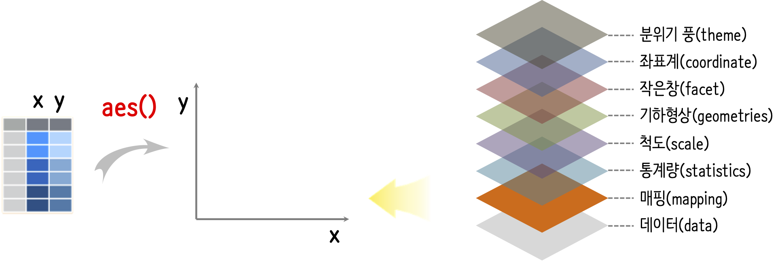
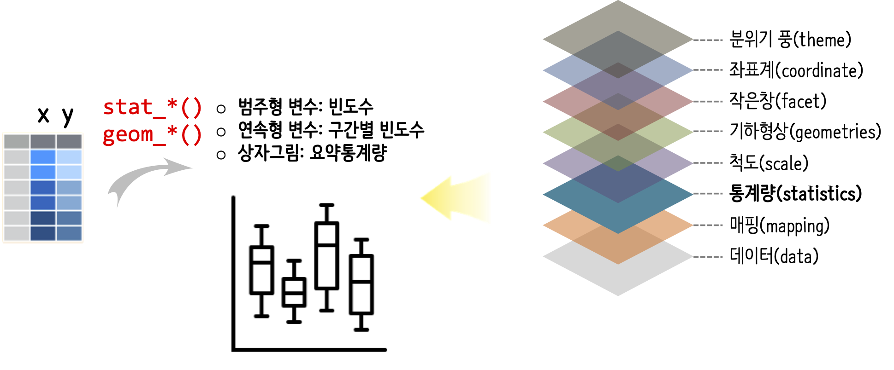
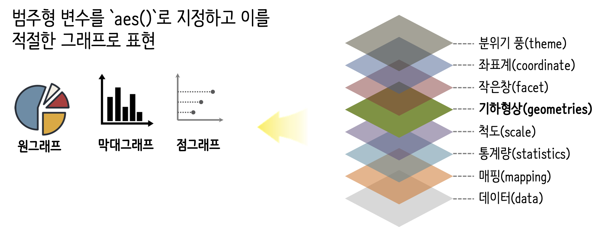
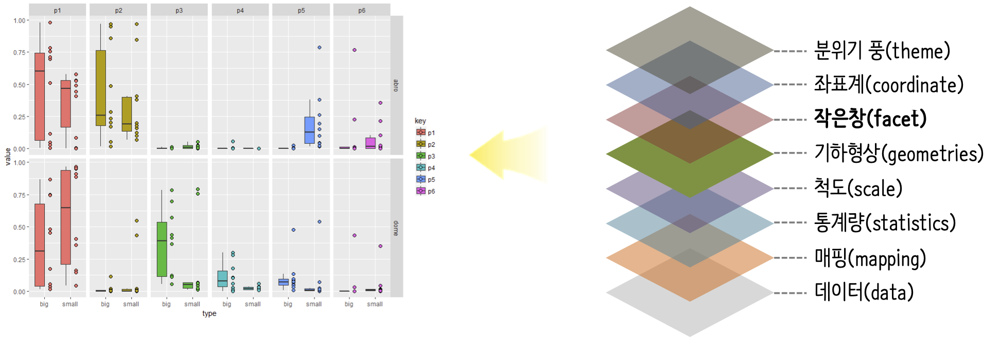
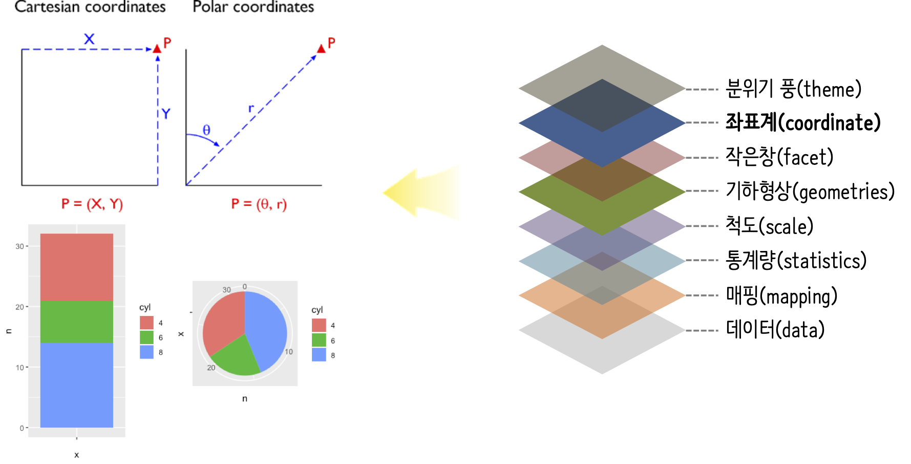
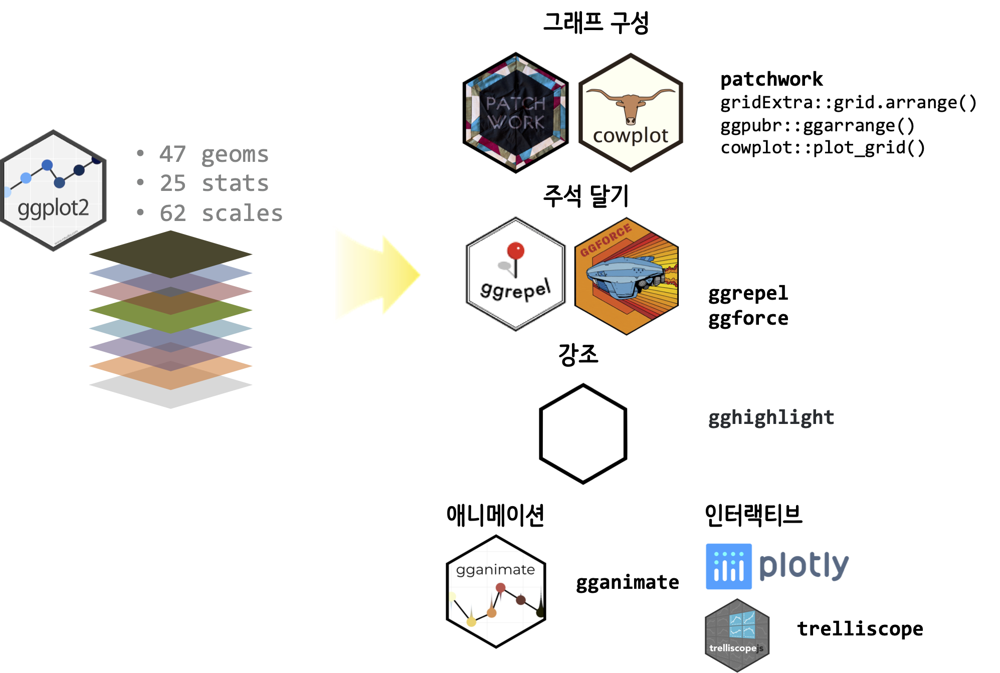

# 시각화 {-}

# 그래프 문법 {#ggplot}

## 그래프 문법의 존재이유 {#why-ggplot2}

Leland Wilkinson의 "The Grammar of Graphics"는 1999년 첫 출간된 이후 **데이터 그래픽(data graphics)**에 많은 영향을 주어 `ggplot2`, Polaris &rarr; Tableau, Vega-Lite 등의 형태로 우리곁에 다가섰다. 
기존 데이터를 시각화한 다양한 그래픽 객체를 만드려면 각 그래픽 객체별로 따로 사용법을 익혀야만 되었다. 
이것이 갖는 한계는 그래프 종류가 적은 경우 유용하지만 그래프 종류가 많아지면 매번 따로 사용법을 배워야되서 
확장가능성이 무척 떨어지게 된다.
그래서, 이를 일반화한 무언가 필요한데 데이터 그래픽 객체를 분해해서 8개 계층으로 분해하여 조립하여
그래프를 제작하게 되면 앞선 문제를 일거에 해소할 수 있다.
**그래프 문법(grammar of graphics)**을 통해 데이터를 가장 잘 표현할 수 있는 그래프를 생성할 수 있게 되었다.

{width="100%"}

## 그래프 문법 {#ggplot2-steps}

그래프 문법은 총 8가지 층으로 구성되어 있는데 이를 각 층별로 나눠보면 다음과 같다.

### 데이터(Data) {#ggplot2-steps-data}

그래프 문법 `ggplot`에 데이터는 깔끔한 데이터(tidy data)를 가정한다. 이를 위해서 기존 `wide`형태 데이터는 key-value `long` 형태로 바뀌어 준비한다.

{width="100%"}

### 매핑(Mapping) {#ggplot2-steps-mapping}

깔끔한 데이터가 준비되면 다음 단계로 칼럼에 해당되는 각 변수를 `aes()` 함수를 사용해서 `aes(x=x, y=y, color=z, ...)`와 같은 방식으로 데이터와 그래프를 매핑한다.

{width="100%"}

### 통계량(statistics) {#ggplot2-steps-statistics}

범주형 그래프를 시각화할 경우 빈도수를 통계량으로 계산해놔야 하고, 연속형 변수를 히스토그램으로 표현할 때도 마찬가지 방식으로 구간별 빈도수를 계산해놔야 하고, 특히 상자그림(boxplot)을 시각화할 경우 각 분위수는 물론이고 중위수도 및 interquantile도 계산해서 수염의 끝도 계산해놔야 제대로된 상자그림을 시각화할 수 있다.

{width="100%"}

### 척도(scales) {#ggplot2-steps-scales}

X축, Y축의 척도를 그래프에서 자동으로 인식하는데는 한계가 있어 이를 필요한 경우 적절한 형태로 설정한다. `scale_<x, y, color, fill, ...>_<유형>()` 구문을 갖는다. 예를 들어 Y축을 담당하는 변수가 로그척도(log)가 적합한 경우 이를 `scale_y_log10()`와 같이 변수를 특성을 반영한 척도를 설정한다. 변수가 날짜나 시간인 경우 `scale_x_date()`, `scale_x_datetime()`을 활용하여 적절한 형태로 설정한다.

{width="100%"}

### 기하형상(geometries) {#ggplot2-steps-geometries}

예를 들어, 범주형 변수를 `aes()`로 지정하고 이를 적절한 그래프로 표현하기 위한 결정과정으로 `geom_*()` 방식으로 원그래프, 막대그래프, 점그래프 등으로 변수를 시각화객체로 지정한다.

{width="100%"}

### 작은 창(facet) {#ggplot2-steps-facet}

원본 데이터를 그룹으로 쪼개 작은 창에 동일한 시각화 객체를 표현하는 방법으로 다차원 데이터를 차원별로 나눠 볼 수 있다. 중요한 점은 각 작은 창이 동일한 유형의 그래프라는 점이 중요하다.

{width="100%"}

### 좌표계(coordinate) {#ggplot2-steps-coordinate}

깔끔한 데이터를 그래프에 매칭하여 시각화한 후에 경우에 따라서 좌표계를 변경할 경우가 있다. `coord_fixed()`, `coord_polar()`, `coord_flip()` 등을 사용해서 특정 영역 확대, 데카르트 좌표계에서 극좌표계, X-Y 축 변경 등의 작업을 수행할 수 있다.

{width="100%"}

### 분위기 풍(theme) {#ggplot2-steps-theme}

분위기 풍(theme)은 앞선 깔끔한 데이터를 시각화 객체로 변환시키는 과정과 아무런 연관이 없다. 대신 외양을 보기좋게 하는 역할을 수행한다. 즉, 시각화에 알맞는 색상 팔레트를 적용시키고, 글꼴을 바꾸는 작업이 여기에 해당된다.

{width="100%"}

## `ggplot` 확장 {#ggplot2-steps-extension}

기본 `ggplot` 그래프 객체를 갖게 되면 2개 이상의 그래프를 합치거나 배열을 달리하고,
강조를 하고 주석(annotation)을 달고 애니메이션과 인터랙티브 기능을 추가하여 확장시킬 수 있다. 

{width="100%"}

