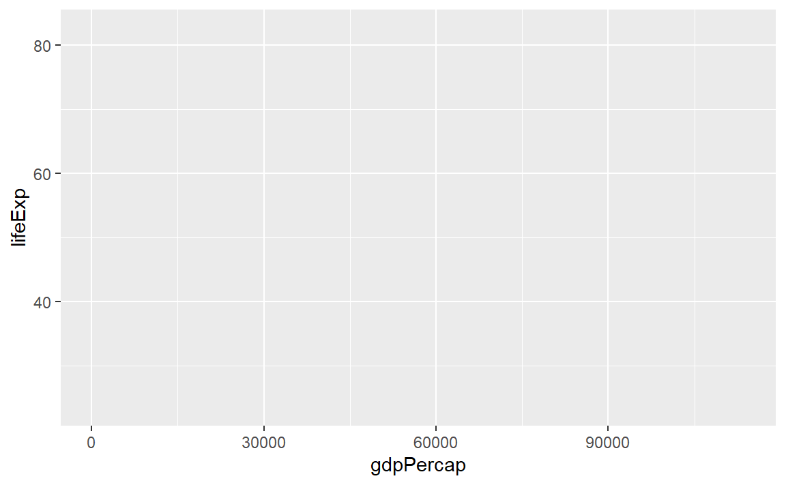
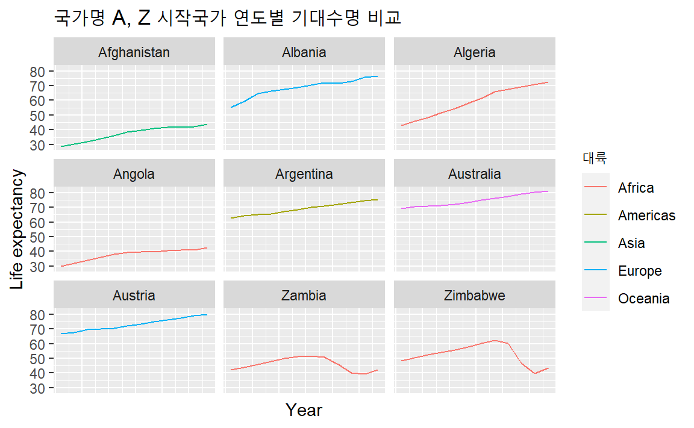

# `ggplot` 시각화  {#ggplot-visualization}

학계 논문, 산업계 발표장표, 산학연구기관에서 발간하는 보고서에 
즉시 사용할 수 있는 시각화 그래프를 어떻게 제작할 것인가? 
이 문제에 가장 기본이 되는 것은 추적가능하고 재현가능한 시각화 그래프를 
제작하여 체계적으로 관리하는 것이다. 특히, 그래프가 데이터에 근거하여 
제작되는 그래프는 더욱 그렇다. 
소프트웨어 카펜트리 "재현가능한 과학적 분석을 위한 R" 내용을 바탕으로 
저자의 경험과 최근 시각화 패키지를 반영했습니다. [@lee2018swc]

데이터를 도식화하는 것은 변수간 다양한 관계를 재빨리 탐색하는 최상의 방식 중 하나로
숫자와 문자로 구성된 데이터를 눈으로 일일이 살펴보는 수고 대신
시각화를 통해 인지부하를 대폭 줄일 수 있기 때문이다.

R에는 세가지 주류 도식화 시스템이 존재한다: [기본 도식화 시스템][base],[lattice][lattice]
팩키지, [ggplot2][ggplot2] 팩키지.

[base]: http://www.statmethods.net/graphs/
[lattice]: http://www.statmethods.net/advgraphs/trellis.html
[ggplot2]: http://www.statmethods.net/advgraphs/ggplot2.html

세가지 도식화 시스템 중에 `ggplot2` 패키지 즉, **그래프 문법(Grammar of Graphics)**을
사용하는 이유는 기본 그래프 문법만 익히면 응용이 무한하여 
원하는 거의 모든 시각화 그래프를 제작할 수 있는 것이 가장 크고,
고품질 그래프 제작이 가능하기 때문이다.

`ggplot2`는 그래픽 문법(grammar of graphics)에 기반했다. 
즉, 모든 그래프도 동일한 구성요소 집합으로 표현된다: 
**데이터셋**, **좌표 시스템**, **geoms** 집합 -- 데이터 점에 대한 시각적 표현.

`ggplot2`를 이해하는 핵심은 그래프를 계층으로 사고하는 것이다: 
포토샵(Photoshop), 일러스트레이터(Illustrator), 잉크스케이프(Inkscape.) 같은 
이미지 편집 프로그램으로 작업하는 것과 동일하지만 이미지 편집 프로그램이
사람이 모든 것을 조작해야 된다면 그래프 문법을 통한 방식은 
그래프 제작 방식을 명시적으로 표현하면 자동으로 고품질 그래프를 기계가 제작한다는 
점에서 차이가 난다.

예제를 가지고 앞서 잡은 개념을 적용해보자.

데이터를 시각화하는 것이 목표이기 때문에 입력은 무조건 데이터가 되고 
데이터도 데이터프레임으로 준비하여 `ggplot`으로 보낸다.
따라서, 처음으로 수행하는 작업은 `ggplot` 함수를 호출하는 것이다. 
이 함수가 R에게 새로운 그래프를 생성하고, 
`ggplot` 함수에 전달되는 인자도 해당 그림에 *전역* 선택옵션(그래프에 있는 모든 계층에 적용)임을 전달한다.
이와 같이 전역 선택옵션으로 선언하게 되면 다음 계층에 적용되는 인자도 자동으로 전달되기 때문에 
타이핑을 줄이는 효과도 있다. 

`ggplot`에 인자를 두개 전달했다.
먼저, `ggplot` 그래프에 사용할 데이터가 무엇인지 전달한다.
`ggplot(data = gapminder)`와 같이 함수에 인자로 넣어도 되지만 
파이프 연산자를 반영하여 코드를 좀더 읽기 좋게 작성하는 것도 가능하다.
두가지 모두 `ggplot()` 에 전달되는 데이터가  `gapminder`데이터프레임이라는 사실은 변하지 않는다.

두번째 인자를 `aes`함수에 전달했는데, 
`ggplot`에게 **데이터**에 나온 변수를 도식화하는 그래프 *시각적 매핑(aes)* 속성에 전달한다; 
이번 경우에는 **x**와 **y** 위치. 여기서 `ggplot`에 `gapminder`데이터프레임 "lifeExp" 칼럼을 **x**-축에, 
"gdpPercap" 칼럼을 **y**-축에 도식화한다. 
명시적으로 `aes`에 칼럼명을 전달(예를 들어, x = gapminder[, "lifeExp"]`)하지 않은 것에 주목한다. 
이것이 가능한 이유는 `ggplot` 함수가 **데이터**에 존재하는 칼럼을 식별할만큼 똑똑하기 때문이다!
이를 통해 중복되는 코딩을 줄여 가독성도 높여 향후 유지보수와 재현가능하게 추적성도 높이는 효과가 있다.

데이터프레임을 입력 데이터로 `ggplot`함수로 보내고 데이터프레임 변수와 시각적 매핑(aes)을 한다고 
도식화가 바로 되는 것은 아니다:

`ggplot` 함수에 데이터를 시각적으로 표현하는 방법도 전달할 필요가 있다. 
**geom** 계층을 추가해서 해당 작업이 수행된다. 
본 사례에서, `geom_point`를 사용했다; 
**x**와 **y** 사이 관계를 시각적으로 산점도 형태로 표현하도록 `ggplot`에게 전달한다.
즉, 1인당 국민소득(`gdpPercap`)과 기대수명(`lifeExp`) 사이 관계를 파악하고자 산점도를 
그리는 것이다.

## 한걸음 더 들어가 보자 {#ggplot-visualization-step-02}

기본적인 개념 이해를 바탕으로 그래프 문법에 따라 `ggplot` 그래프를 제작했다.
상기예제를 변경해서, 기대수명이 시간에 따라 어떻게 변해왔는지 시각화하는 그림을 생성해보자.
`gapminder` 데이터프레임에서 1인당 국민소득(`gdpPercap`)과 기대수명(`lifeExp`) 변수를 이전 그래프 제작에 
사용했다면 시간에 따른 기대수명 변화를 파악하기 위해 먼저 `gapminder` 데이터프레임의 
`year` 변수에 주목하고 **x**-축에 반영하면 해당 문제를 풀 수 있다.

이전 그래프에서 `aes` 함수를 사용해서 **geom** 산점도로 **x** 와 **y** 지점을 
각 점에 대해 표현했다. 변경할 수 있는 또다른 *시각적 매핑(aes)* 속성은 각 점에 대한 *색깔*이다.
앞선 코드를 변경해서 "continent" 대륙별로 각 점에 **색**을 입혀보자.
이를 통해 "continent" 칼럼 **색상(color)**에 적용할 경우 대륙별로 기대했던 추세를 
직접 눈으로 확인하여 기존에 갖고 있던 고정관념과 데이터를 통해 실증할 수도 있다.
즉, 기대수명은 모든 대륙에서 국가별로 높아지고 있으나 아프리카 국가와 유럽국가들 사이
간극은 좁혀지고 있지 않다.

## 계층(Layers)

산점도가 아마도 시간에 따라 변하는 정보를 시각화하는데 최선은 아니다.
시간에 따른 시계열 변화에는 **선그래프(line plot)**가 적절하다.
`ggplot`에 점그래프 대신 선그래프(line plot)로 데이터를 시각화한다.

`geom_point` 계층을 추가하는 대신에, `geom_line` 계층을 추가했다.
*aes*로 **group**(혹은 **by**)를 추가하면 자동으로 `ggplot`이 각 국가를 직선으로 연결해서 도식화한다.

하지만, 직선과 점을 함께 시각화하려고 하면 어떨까?
단순히, 또다른 계층을 그림에 추가하면 된다:

각 계층은 이전 계층 위에 도식화됨에 주목한다.
이번 예제에서, 점이 직선 *위에* 도식화되었다.
다음에 도식화한 산출물에서 결과를 확인할 수 있다.

시각적 매핑(`aes`)에서 `color=continent`가 전역이 아니라 `geom_line()` 내 로컬로 
이동한 것에도 주목한다. *aesthetic*인 **색상** 매핑이 `ggplot`에 전역으로 설정된 점 선택옵션에서 
`geom_line` 계층으로 이동했다. 그래서, 해당 점에는 더이상 적용되지 않는다.
이제 분명하게 직선 위에 점이 도식화된 것을 확인할 수 있다.

지금까지 (**색상**같은) aesthetic 를 데이터의 변수로 *매핑(mapping)*해서 사용하는 법을 살펴봤다.
예를 들어, `geom_line(aes(color=continent))`을 사용하면, ggplot에서 자동으로 각 대륙별로 다른 색상을 입힌다.
그런데, 모든 선을 파란색으로 바꾸고자 하면 어떨까?  `geom_line(aes(color="blue"))` 명령어가 동작해야 된다고 생각하지만,
사실은 그렇지 않다.특정 변수에 대한 매핑을 생성하지 않았기 대문에,
`aes()` 함수 밖으로 색상을 명세하는 부분을 예를 들어, `geom_line(color="blue")`와 같이 빼내기만 하면 된다.

앞선 예제에서 점과 직선 계층 코딩 순서를 뒤바꾼다. 어떻게 될까요?
선이 점 위에 올라온다! 이런 특성을 인지하고 염두에 두면 추후 좀더 미련한 
시각화 결과물을 제작할 수 있게 된다.
 

## 변환(Transformations)과 통계량(statistics)

`ggplot`으로 데이터 위에 통계적 모형을 쉽게 겹치게도 할 수 있다.
믿을 수 없다면 앞서 제작한 시각화 예제로 예제로 되돌아간다:

현재, 일인당 GDP에 일부 심각한 이상점이 있어 점(국가) 사이 내재된 관계를 보기 힘들다.
*scale* 척도함수를 사용해서 y-축 척도를 변경한다.
이것을 통해 데이터 값과 *aesthetic* 시각값 사이 매핑을 제어한다.
*alpha* 함수를 통해 투명도도 조정할 수 있다.
군집으로 많은 데이터가 모아진 경우 특히 투명도 조절을 유용하다.

그래프에 렌더링하기 전에 `log10` 함수가 `gdpPercap` 칼럼값에 변환을 시켰다.
그래서, 각 자리수 10은 변환된 척도에 1씩 증가에 대응된다. 
예를 들어, 1인당 GDP 1,000은 y-축에 3, 10,000은 y-축에 4에 대응된다.
로그 변환은 x-축에 흩어진 데이터 시각화를 쉽게 도와준다.

> ** `aesthetic`에 매핑대신 값 설정 **
>
> `geom_point(alpha = 0.5)` 을 사용한 것에 주목한다.
> 앞서 언급했듯이, `aes()` 함수 외부에서 설정된 것은 모든 점에 대해서 지정한 값이 적용되게 된다.
> 투명도 지정(`alpha`)은 이 경우 원하는 바로 문제가 전혀 없다.
> 하지만, 다른 `aesthetic` 설정처럼, *alpha* 투명도를 데이터의 변수에 매핑시킬 수도 있다.
> 예를 들어, 각 대륙별로 다른 투명도를 적용시키고자 하면, `geom_point(aes(alpha = continent))` 코딩하는 것도 가능하다.

또다른 계층(`geom_smooth`)을 추가해서 관계를 단순히 적합시킬 수 있다:

굵은 선은 `geom_smooth` 계층에 *aesthetic* **크기**를 설정해서 조정할 수 있다:

시각적 매핑(aes) 항목을 명세할 수 있는 방식이 두개 있다.
바로 앞에서 `geom_smooth` 함수에 인자로 전달해서 **크기**에 대한 시각적 매핑 설정을 했다.
앞에서는 `aes()` 함수를 사용해서 데이터 변수와 시각적 표현 사이 *매핑*으로 정의했다.

바로 앞 예제에서 점 계층에 나온 점 크기와 색상을 변경해보자.
`aes()` 함수를 사용하지 않고 특정 색상 예를 들어 오렌지(orange) 색상으로 
변경시키고 함께 크기도 달리한다.

한걸음 더 나아가 점(국가)들이 다른 형태(shape)를 갖고 
대륙별로 색상을 달리하는데 대륙별로 추세선을 반영한다.
이 경우는 색상 인자를 시각적 매핑 함수 `aes()` 내부로 위치를 조정하여 
인자로 넘긴다.

## 다중-창(Multi-Panel) 그림

앞에서 그래프 하나에 모든 대륙 국가에 대해 시간의 변화에 따른 기대수명 변화를 시각화했다.
대안으로, **패싯(facet)** 창 계층을 추가해서, 그래프를 여러개 창으로 쪼갤 수도 있다:
"A" 혹은 "Z"로 시작하는 국가명을 갖는 나라만 집중해 보자.
국가가 많다보니 편의상 "A" 혹은 "Z"로 시작하는 국가명을 통해
대략 10개 내외 범주를 갖는 시각화를 하는데 유용한 기법이다.

`dplyr` 패키지 `mutate()`와 `filter()` 함수를 조합하여 주어진 문제에 해결할 수 있는 
데이터프레임을 준비하고 이를 `facet_wrap()` 함수에 넣어 국가별로 연도별
기대수명을 한눈에 비교할 수 있도록 시각화한다.

여기서 `str_sub()` 함수는 문자를 전문으로 다루는 `stringr` 패키지의 함수로 
문자열의 일부를 추출하는데 사용했다. 물론 다른 함수나 코드를 통해 해당 문제를 
풀수도 있다. 주어진 문제를 풀 수 있는 가장 직관적이고 간결한 코드 작성을 추천한다.

`facet_wrap` 계층은 "공식(formula)"을 인자로 받는데, (`~`) 틸드로 표기한다.
`gapminder` 데이터셋 국가별 칼럼의 유일한 값 각각에 대해 별도 창을 통해 도식화한다.

## 텍스트 변경하기 {#change-text}

고품질 출판에 적합하게 그래프를 깔끔하게 만들려면, 텍스트 요소를 변경할 필요가 있다.
x-축이 중복되어 난잡하게 보일 수 있고, 
y-축은 데이터프레임 칼럼명이 아닌 영어로 "Life expectancy", 혹은 "기대수명"으로 적혀있어야
그래프 가독성을 높일 수 있다.

`ggplot`에서 이 문제도 몇개 다른 계층을 추가함으로써 텍스트를 간단히 변경할 수 있다.
**theme** 계층은 각 축에 대한 텍스트, 전반적인 텍스트 크기를  제어한다.
축, 그래프 제목, 범례는 `labs()` 함수를 사용해서 설정하다.
범례 제목은 `aes()` 함수에서 명세한 것과 동일한 명칭을 사용한다.
따라서, 색상 범례 제목은 `color = "대륙"`이 되는 반면에,
채우기(`fill`) 범례는 `fill = "대륙"`으로 설정하게 된다.

## 그래프 내보내기 {#ggplot-export}

`ggsave()` 함수를 사용해서 `ggplot`으로 생성시킨 그래프를 내보내서 로컬 컴퓨터에 저장할 수 있다.
고품질 그래픽 산출물을 생성하기 위해서 
그래프 크기와 해상도를  `ggsave()` 함수의 인자(`width`, `height`, `dpi`)로 넘기면 된다.
앞서 생성한 그래프를 저장하려면, 먼저 적절한 변수명 예를 들어, `lifeExp_plot` 변수에 그래프를 할당하고 나서, 
`ggsave()` 함수에 `png` 형식으로 `results` 디렉토리에 저장하도록 지정한다.
(현 작업디렉토리에 `results/` 폴더가 생성되어 있어야 한다.)

`ggsave()` 함수에 두가지 멋진 점이 있다.
첫째는 기본설정값으로 가장 마지막 그래프가 지정되어 있어서,
`plot =` 인자를 생략하게 되면, 자동으로 `ggplot`으로 생성한 마지막 그래프가 저장된다.
둘째로, 저장되는 그래프 이미지 형식이 파일명으로 전달하는 파일 확장자(예를 들어, `.png` 혹은 `.pdf`)에 따라 결정된다.
필요한 경우, `device` 인자에 명시적으로 파일 형식을 지정할 수도 있다.

지금까지 `ggplot2` 맛을 보았다. RStudio는 정말 유용한 [cheat sheet][cheat]를 통해서 다른 계층 사용법에 대한 
참고서로 충실한 정보를 제공하고 있고, [ggplot2 웹사이트][ggplot-doc]에 추가기능에 대한 상세한 정보가 공개되어 있다.

마지막으로, 어떻게 수정을 해야하는지 아무런 생각이 없다면, 구글 검색을 통해서 결국 Stack Overflow 웹사이트에 
재사용 가능한 코드를 통해서 관련된 질문과 답변을 수월히 얻을 수 있다!

[cheat]: http://www.rstudio.com/wp-content/uploads/2015/03/ggplot2-cheatsheet.pdf
[ggplot-doc]: http://docs.ggplot2.org/current/

마지막으로 대륙별로 1인당 GPD 밀도 그래프를 생성해보자.

- x-축을 변경해서 쭉 펼쳐진 데이터를 좀더 보기좋게 시각화한다.
- 패싯(facet) 계층을 추가해서 연도별로 밀도 그래프를 창에 도식화한다.

기존 그래프에 가독성을 높이기 위해 범례 위치를 기본설정인 우측에서 상단으로 이동하고 
1인단 국민소득 숫자도 과학표기법이 아닌 일반 숫자 표기법을 반영하여 가독성을 높였다.
이외 독자가 더 쉽게 정보를 파악할 수 있도록 필요한 경우 전문분야 지식을 반영하여 
미려한 그래프 제작도 가능하다.

