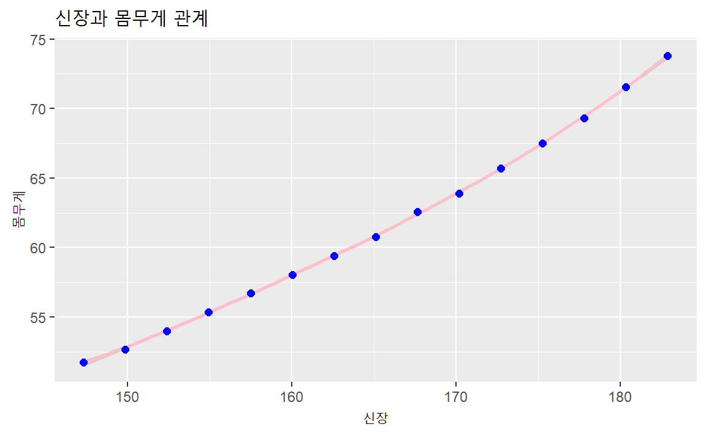
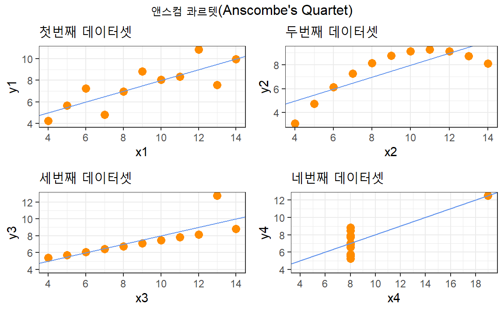
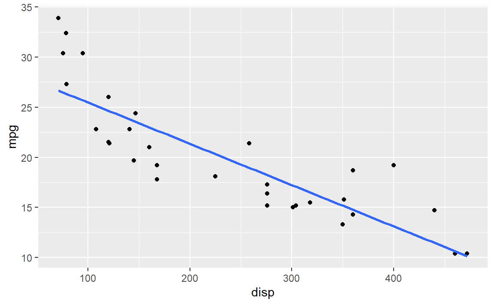

# 시각화 {#viz-motivation}

컴퓨터를 기반으로 한 시각화 시스템은 시각적으로 데이터를 표현함으로서 
사람이 작업을 더욱 효율적으로 수행할 수 있도록 돕는다.

시각화는 시각지능을 갖춘 인공지능을 통해 사람을 대체하는데 초점을 둔 것이라보다 
시각화를 통해 인간능력을 보조하고 증강시키는데 유용하다.

따라서, 완전 자동화 해결책이 존재하고 신뢰성이 있는 경우 대안이 존재하는 경우 시각화는 필요하지 않다. 하지만, 많은 분석과 개발문제에 어떤 질문을 던져야 되는지 사전에 알고 있는 경우가 적어, 명세가 분명하지 않는 경우 시각화가 적합하다.

## 왜 시각화가 필요한가? {#viz-tamara-why}

시각화는 최종 데이터분석 결과를 표현하는 데이터 과학 제품과 인포그래픽으로 많은 관심을 받았다. 하지만 꼭 시각화가 데이터 과학 최종 결과물로 의미가 있는 것은 아니다. 인포그래픽과 같은 최종 결과를 제작하는 과정은 수많은 시도와 실패의 결과물로 조금씩 진전을 이뤄낸 산출물이다. 이 과정에서 데이터에 대한 충분한 이해가 필요한데 원본 데이터를 눈으로 일일이 살펴보거나 요약 통계량으로 데이터가 갖고 있는 의미를 충분히 살펴보는데는 한계가 있다. 
원데이터를 첫번째 행부터 마지막행까지 첫번째 변수부터 마지막 변수까지 일일이 살펴보는 작업은 상당한 인지부하를 가져와 쉽게 피로를 유발한다. **인지부하(cognitive load)**를 **시각적 지각(perception)**으로 해당 작업을 바꿔 수월히 업무를 수행하는데 필수적인 기법이 **시각화(Visualization)**라고 볼 수 있다.


```r
library(tidyverse)
library(kableExtra)

datasets::women %>% 
  kableExtra::kbl() %>% 
  kableExtra::kable_styling()
```

<table class="table" style="margin-left: auto; margin-right: auto;">
 <thead>
  <tr>
   <th style="text-align:right;"> height </th>
   <th style="text-align:right;"> weight </th>
  </tr>
 </thead>
<tbody>
  <tr>
   <td style="text-align:right;"> 58 </td>
   <td style="text-align:right;"> 115 </td>
  </tr>
  <tr>
   <td style="text-align:right;"> 59 </td>
   <td style="text-align:right;"> 117 </td>
  </tr>
  <tr>
   <td style="text-align:right;"> 60 </td>
   <td style="text-align:right;"> 120 </td>
  </tr>
  <tr>
   <td style="text-align:right;"> 61 </td>
   <td style="text-align:right;"> 123 </td>
  </tr>
  <tr>
   <td style="text-align:right;"> 62 </td>
   <td style="text-align:right;"> 126 </td>
  </tr>
  <tr>
   <td style="text-align:right;"> 63 </td>
   <td style="text-align:right;"> 129 </td>
  </tr>
  <tr>
   <td style="text-align:right;"> 64 </td>
   <td style="text-align:right;"> 132 </td>
  </tr>
  <tr>
   <td style="text-align:right;"> 65 </td>
   <td style="text-align:right;"> 135 </td>
  </tr>
  <tr>
   <td style="text-align:right;"> 66 </td>
   <td style="text-align:right;"> 139 </td>
  </tr>
  <tr>
   <td style="text-align:right;"> 67 </td>
   <td style="text-align:right;"> 142 </td>
  </tr>
  <tr>
   <td style="text-align:right;"> 68 </td>
   <td style="text-align:right;"> 146 </td>
  </tr>
  <tr>
   <td style="text-align:right;"> 69 </td>
   <td style="text-align:right;"> 150 </td>
  </tr>
  <tr>
   <td style="text-align:right;"> 70 </td>
   <td style="text-align:right;"> 154 </td>
  </tr>
  <tr>
   <td style="text-align:right;"> 71 </td>
   <td style="text-align:right;"> 159 </td>
  </tr>
  <tr>
   <td style="text-align:right;"> 72 </td>
   <td style="text-align:right;"> 164 </td>
  </tr>
</tbody>
</table>


`datasets` 패키지에 포하함된 `women` 데이터는 이미 정렬이 되어 있어서, 신장이 커짐에 따라 체중이 증가하는 것을 알 수 있지만, 데이터만 보고 이해하려면 인지적으로 데이터 한줄을 읽고 머리속으로 생각하고, 두번째 줄을 읽고 생각하고, ... 이런 과정을 반복하면서 인지적 부하가 증가하게 된다.
하지만, 시각적으로 표현하게 되면 한눈에 신장과 체중 관계를 볼 수 있다.

`women` 데이터셋이 몸무게는 파운드(lbs), 신장(inch)로 되어 있어 우리나라에서 사용하는
kg, cm 단위로 시각화에 앞서 변환시킨다.


```r
women %>% 
  mutate(height = 2.54 * height,
         weight = 0.45 * weight) %>% 
  ggplot(aes(y=weight, x=height)) + 
    geom_smooth(color='pink') +
    geom_point(color='blue', size=2) +
    labs(x = "신장",
         y = "몸무게",
         title = "신장과 몸무게 관계")
```




## Anscombe 4종류 데이터 {#viz-anscombe}

Anscombe[@anscombe1973graphs]는 1973년 "Anscombe's Quartet"로 알려진 동일한 통계량을 갖는 4종류 데이터셋을 만들어서 시각화의 중요성을 공개했다. 4종류의 데이터는 모두 동일한 평균, 분산,
상관계수와 회귀식을 갖는다. 두 변수 `x`, `y`에 대한 통계량에 대한 정보는 다음과 같다.

|  통계량     |   값  |
|:-------------:|:-------:|
|  평균(`x`)  |  9    |
|  분산(`x`)  |  11   |
|  평균(`y`)  |  7.5  |
|  분산(`y`)  |  4.1  |
|  상관계수   |  0.82  |
|  회귀식     |  $y = 3.0 + 0.5 \times x$ |


### 데이터셋 기술통계량 {#viz-anscombe-descriptive}

`datasets` 패키지 내부에 `anscombe` 명칭으로 데이터셋이 포함되어 있어 앞서 제기한 
기술통계량이 맞는지 평균, 분산, 상관계수, 회귀식 회귀계수를 통해 소수점 아래 일부 차이가 있지만 동일하다는 것을 확인할 수 있다.


### 데이터셋 시각화 {#viz-anscombe-viz}

`anscombe` 데이터셋 기술 통계량을 통해 4종류 데이터셋이 동일한 분도를 갖고 있고
표본추출로 보면 모집단에서 잘 추출된 표본이라고 볼수도 있으나 시각화를 통해 보면
전혀 다른 특성을 갖는 데이터라는 것을 한번에 알 수 있다. 즉, 가장 일반적으로 
첫번째 데이터셋과 같은 특성이 기술통계량을 통해 존재한다는 것이 일반적이다.
하지만, 2차식이 내재된 두 변수의 관계(두번째 데이터셋)일 수도 있으며,
강한 선형 관계가 두변수 사이 존재하지만 튀는 관측점이 하나 존재하는 관계(세번째 데이터셋)일 수도 
있으며 네번째 데이터세의 경우 데이터 입력과정에서 오류가 의심되는 경우(네번째 데이터셋)일 수도 있다.


```r
# https://rpubs.com/debosruti007/anscombeQuartet 코드를 일부 변형하여 시각화 사용
p1 <- ggplot(anscombe) + geom_point(aes(x1, y1), color = "darkorange", size = 3) + theme_bw() + scale_x_continuous(breaks = seq(4, 20, 2)) + scale_y_continuous(breaks = seq(0, 12, 2)) + geom_abline(intercept = 3, slope = 0.5, color = "cornflowerblue") + expand_limits(x = 4, y = 4) + labs(title = "첫번째 데이터셋")
p2 <- ggplot(anscombe) + geom_point(aes(x2, y2), color = "darkorange", size = 3) + theme_bw() + scale_x_continuous(breaks = seq(4, 20, 2)) + scale_y_continuous(breaks = seq(0, 12, 2)) + geom_abline(intercept = 3, slope = 0.5, color = "cornflowerblue") + expand_limits(x = 4, y = 4) + labs(title = "두번째 데이터셋")
p3 <- ggplot(anscombe) + geom_point(aes(x3, y3), color = "darkorange", size = 3) + theme_bw() + scale_x_continuous(breaks = seq(4, 20, 2)) + scale_y_continuous(breaks = seq(0, 12, 2)) + geom_abline(intercept = 3, slope = 0.5, color = "cornflowerblue") + expand_limits(x = 4, y = 4) + labs(title = "세번째 데이터셋")
p4 <- ggplot(anscombe) + geom_point(aes(x4, y4), color = "darkorange", size = 3) + theme_bw() + scale_x_continuous(breaks = seq(4, 20, 2)) + scale_y_continuous(breaks = seq(0, 12, 2)) + geom_abline(intercept = 3, slope = 0.5, color = "cornflowerblue") + expand_limits(x = 4, y = 4) + labs(title = "네번째 데이터셋")

gridExtra::grid.arrange(p1, p2, p3, p4, ncol=2, top = "앤스컴 콰르텟(Anscombe's Quartet)")
```




## 시각화 얼개 {#viz-framework}

오랜동안 시각화를 연구한 타마라 먼즈너(Tamara Munzner) 교수는 시각화를 위한 얼개(framework)로
다음 4가지 영약으로 나눠 공학적 접근을 취할 것을 제안하고 있다.[@munzner2014visualization]
타마라 교수가 제안한 시각화 분석 얼개는 4가지 부분으로 구성된다. 

- 전문영역 : 최종 사용자 고객이 누군인가?
- 추상화
    + 전문영역의 구체적인 점을 시각화 용어로 번역
        * **데이터 추상화** : 시각화하는 것이 무엇(what)인가?
        * **작업 추상화** : 왜(why) 사용자가 눈을 돌리는가?
- 표현양식(idiom)
    + 데이터가 어떻게(How) 시각화되는가?
    	* **시각적 인코딩 표현양식** : 시각화하는 방법
    	* **상호작용 표현양식** : 조작하는 방법
- 알고리즘
	+ 효율적 연산방법    	

{width=100%}

시각화 시스템 실행시간, 메모리 사용량 등을 측정하고, 연산 복잡성을 분석하는 알고리즘 작업은 컴퓨터 과학자의 몫이다.
여러가지 대안 시스템 아키텍처를 정당화하고 시각적 인코딩 방법과 상호작용하는 표현양식을 설계하는 것은 시스템 설계자의 몫이다.
시각화 시스템 결과물을 정량적으로 분석하고, 사용자 인간에 대한 실험을 추진하는 것은 인지심리학자의 몫이다.
이를 감싸고 있는 데이터 추상화와 작업추상화가 있는데, 시스템 설계자가 앞단에서 설계하면 후행단에서 인지심리학자가 검증하고, 컴퓨터 과학자가 개발하는 구조를 갖는다.

이 모든 시작은 전문영역에서 문제점을 인식하고 기존의 도구를 사용하는 목표 사용자를 관측하는 것에서 시작되는데 이는 인류학자, 민족지라는 분야와 연관된다.
따라서, 기술중심으로 밖으로 퍼져나갈 수도 있지만, 문제해결작업으로 시각화를 활용하는 것도 가능한 접근법이다.

## R 시각화 시스템 {#viz-R-system}

동일한 시각화 산출물을 제작한다고 하더라도 철학에 따라 차이점이 있다.
크게 시각화 도구는 명령형과 선언형으로 나눠지고 그래프 문법을 따르는
`ggplot`의 경우 선언형에 해당된다.

::: {#viz-programming .rmdimportant}
<h4>시각화 도구</h4>

- **명령형(imperative)**: "방법(how)"에 초점, Processing, OpenGL, prefuse
- **선언형(declarative)**: "무엇(what)"에 초점, D3, ggplot2, Protovis 
:::

R은 역사가 오래된 검증된 언어라 보니 그 시대의 컴퓨팅 환경과
축적된 지적자산이 반영되어 다양한 시각화 시스템이 존재한다. 
가장 대표적으로 3가지 시각화 시스템을 이해하면 실무적으로 충분하다.

- Base 시각화 시스템
- `lattice` 시각화 시스템: Cleveland의 **Trellis Graphics**에서 출발
- `ggplot` 시각화 시스템: Wilkinson의 **Grammar of Graphics**에서 출발

2017년 3월 기준 R 팩키지를 시각화 시스템으로 구분하면 다음과 같다.
현재는 `ggplot`이 후발주자의 잇점을 발휘하여 대세로 자리잡았고 
이는 `ggplot2` 패키지 기여자수, 코드 길이, 연관된 패키지수를 확인하면 
쉽게 파악할 수 있다.

|  시각화 시스템  |   팩키지 갯수   |
|:---------------:|:---------------:|
|Base 시각화      |      5,612       |
|`lattice` 시각화 |      3,654       |
|`ggplot` 시각화  |      1,566       |


### Base 시각화 시스템 {#viz-base-system}

R설치하면 내장된 Base 시각화 시스템은 **화가의 팔레트(Artist Palallete)** 모형으로 빈 도화지 캔바스 위에 화가가 그림을 그리는 것과 동일한 방식으로 시각화 산출물을 만들어 나간다.
`plot()` 혹은 유사한 시각화 함수로 시작해서 텍스트(`text`), 선(`line`), 점(`point`), 축(`axis`) 등을 표현하는데  **주석(Annotation)** 함수를 활용한다.

따라서, 사람이 사고하는 방식으로 시각화 산출물을 만들어 나가 편리하지만, 시각화 산출물을 다시 그리려고 하면 처음부터 다시 해야 되기 때문에 시각화 산출물을 
만드는 초기부터 시간을 갖고 잘 설계해 나가야 된다. 그리고, 시각화 산출물이 생성되면 다른 것으로 변환하기 어려운 단점이 있고, 그래픽 언어가 아니라 일련의 R 명령어
묶음에 불가하다.


### `lattice` 시각화 시스템 {#viz-lattice-system}

`lattice` 시각화 시스템은 `lattice` 팩키지를 통해 설치되고, 함수 호출(`xyplot()`, `bwplot()` 등)을 통해 시각화 산출물을 생성하게 된다.
조건에 따라 일변량 혹은 다변량 변수를 시각화하는데 유용하다. 즉, 특정 범주형 변수 수준에 따라 두 변수간의 관계를 시각적으로 표현하는 것을 예로 들 수 있다.
전체 시각화 산출물 결과는 여백(margin), 공간 등은 자동으로 한번에 정해져서, 화면에 다수 시각화 산출물을 배치할 때 유용하다.

하지만, 함수호출 한번으로 전체 시각화 산출물을 명세하는 것이 쉽지는 않다. 특히 주석(Annotation)을 시각화 산출물에 다는 것이 그다지 직관적이는 않다.
그리고 `lattice` 함수를 통해 시각화 산출물이 만들어지면 더이상 추가는 불가하다.

[키보드 자판으로 통계모형을 R로 표현하는 방법](https://statkclee.github.io/statistics/stat-modeling.html)처럼 변수들을 `lattice` 시각화 시스템에서 
공식으로 표현할 수 있다는 점은 큰 장점중 하나다.


### `ggplot` 시각화 시스템 {#viz-ggplot-system}

`ggplot` 시각화 시스템은 `ggplot2` 팩키지를 통해 설치가 가능하다. Base 시각화 시스템과 `lattice` 시각화 시스템의 장점을 취사선택해서 개발된 것으로 보는 견해도 있다.
그래픽 문법(Grammer of Graphic)에 기반하고 있으며, `lattice` 시각화 시스템처럼 공백, 텍스트, 제목 등을 자동으로 설정하고,
Base 시각화 시스템에서 지원하는 다양한 그래픽 요소를 추가하는 것도 가능하다. 전반적으로 `lattice`느낌이 나지만 사용하기는 직관적이며 다양한 그래픽 요소를 
추가하는 것도 쉽다. 물론 `ggplot`에서 자동으로 설정하는 것도 원하는 설정으로 바꾸는 것도 가능하다.



### `grid` 시각화 시스템 {#viz-grid}

`grid` 시각화 시스템은 `lattice`와 `ggplot`의 기반이 되는 시각화 시스템으로 R 버전 1.8.0 부터 Base 팩키지의 일부가 되었다.[^grid-viz-system]
grid_0.7-4에서 [Base 팩키지 일부](https://stat.ethz.ch/R-manual/R-devel/library/grid/doc/changes.txt)가 되어 버젼이 Base 팩키지에 맞춰 버젼이 급상승했다.

`grid` 시각화 시스템을 사용해서 위와 동일하게 상기 그래프를 그리면 다음과 같다. 
`grid` 시스템을 숙달하기까지 시간이 걸리지만, 익숙해지면 장점이 상당하다.

[^grid-viz-system]: [R package grid disappeared?](http://stackoverflow.com/questions/29349398/r-package-grid-disappeared)


